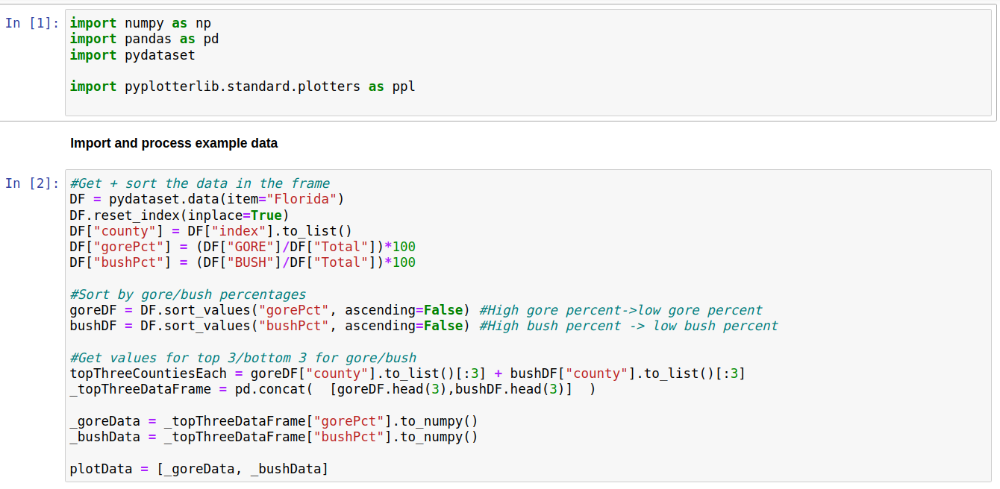
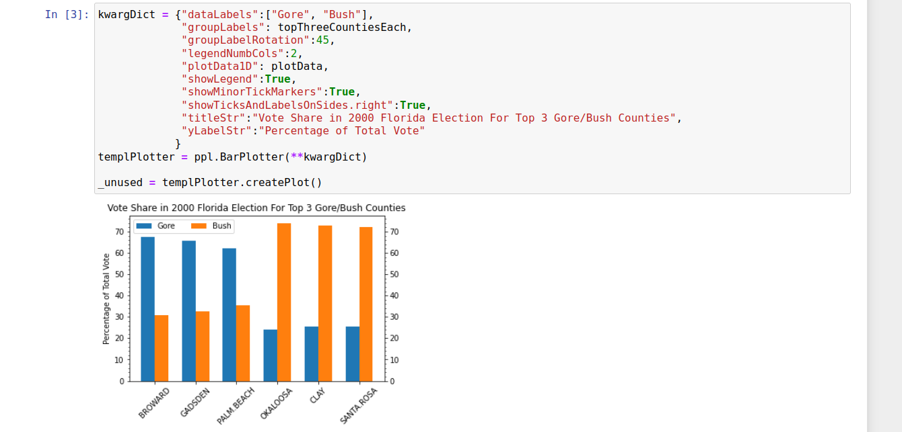
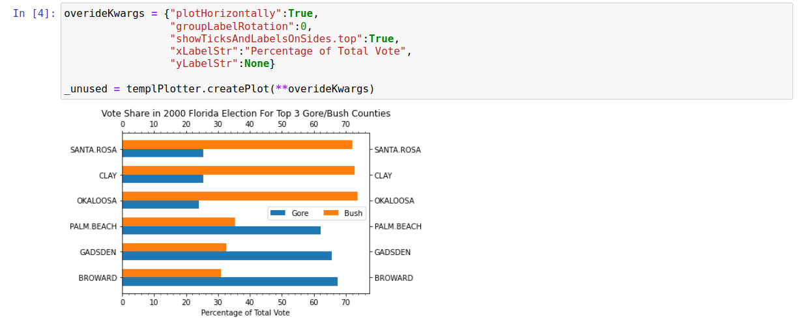

Bar Plotter
===========

Introduction
------------

In this example we create plots to visualize data in the "florida" dataset from the pydataset library. This shows the number of votes received for presidential candidates for counties in Florida for the 2000 election, with Gore and Bush being the most relevant candidates (and the ones we focus on). 

Processing Data
---------------

In this case we will plot the percentage of votes for Gore/Bush in their top 3 counties. To extract this from the raw data involves: i) Calculating percentage votes from total votes, ii) sorting by vote percentages for Bush/Gore, and iii) extracting the top 3 counties in each case. The code to extract the relevant plot data is shown below:

Plotting Data
-------------

Having extracted the data, we first show how to use it to plot a vertical bar chart:

We can reuse most of these options to create a horizontal bar chart instead if desired:

Raw Code
--------

The following code will create and save the plots above::

	import numpy as np
	import pandas as pd
	import pydataset
	import matplotlib.pyplot as plt #For saving images
	import pyplotterlib.standard.plotters as ppl
	
	DF = pydataset.data(item="Florida")
	DF.reset_index(inplace=True)
	DF["county"] = DF["index"].to_list()
	DF["gorePct"] = (DF["GORE"]/DF["Total"])*100
	DF["bushPct"] = (DF["BUSH"]/DF["Total"])*100
	
	goreDF = DF.sort_values("gorePct", ascending=False) #High gore percent->low gore percent
	bushDF = DF.sort_values("bushPct", ascending=False) #High bush percent -> low bush percent
	
	topThreeCountiesEach = goreDF["county"].to_list()[:3] + bushDF["county"].to_list()[:3]
	_topThreeDataFrame = pd.concat(  [goreDF.head(3),bushDF.head(3)]  )
	
	_goreData = _topThreeDataFrame["gorePct"].to_numpy()
	_bushData = _topThreeDataFrame["bushPct"].to_numpy()
	
	plotData = [_goreData, _bushData]
	
	kwargDict = {"dataLabels":["Gore", "Bush"],
	             "groupLabels": topThreeCountiesEach,
	             "groupLabelRotation":45,
	             "legendNumbCols":2,
	             "plotData1D": plotData,
	             "showLegend":True,
	             "showMinorTickMarkers":True,
	             "showTicksAndLabelsOnSides.right":True,
	             "titleStr":"Vote Share in 2000 Florida Election For Top 3 Gore/Bush Counties",
	             "yLabelStr":"Percentage of Total Vote"
	            }
	templPlotter = ppl.BarPlotter(**kwargDict)
	_unused = templPlotter.createPlot()
	plt.savefig("barPlotterA_imgA")
	
	overideKwargs = {"plotHorizontally":True,
	                 "groupLabelRotation":0,
	                 "showTicksAndLabelsOnSides.top":True,
	                 "xLabelStr":"Percentage of Total Vote",
	                 "yLabelStr":None}
	_unused = templPlotter.createPlot(**overideKwargs)
	plt.savefig("barPlotterA_imgB")
	

