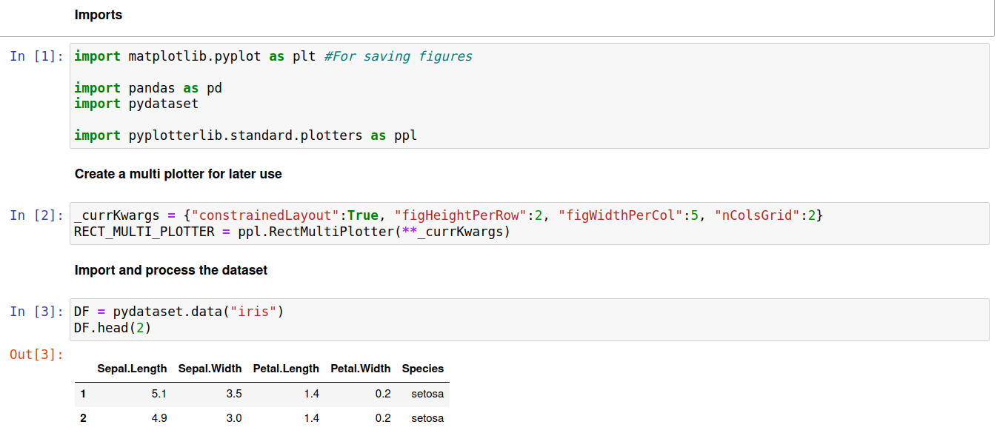
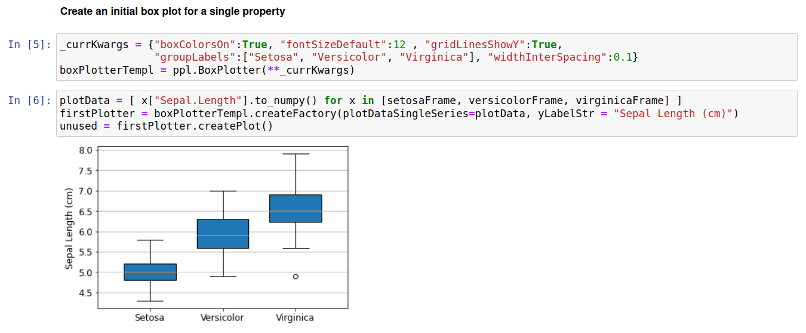
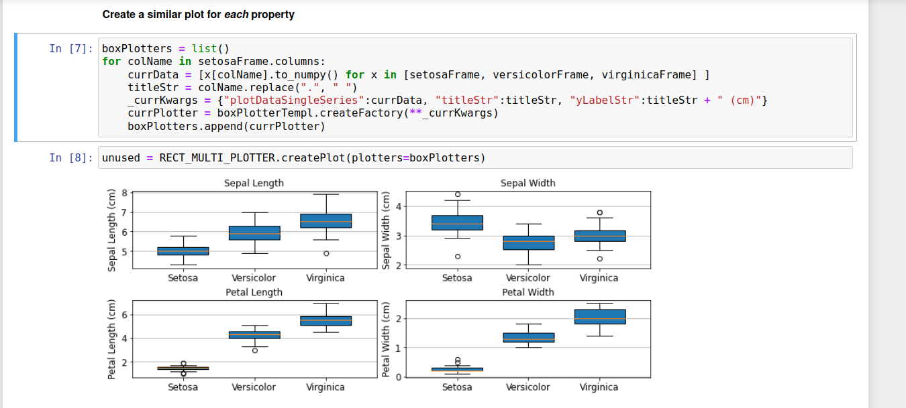
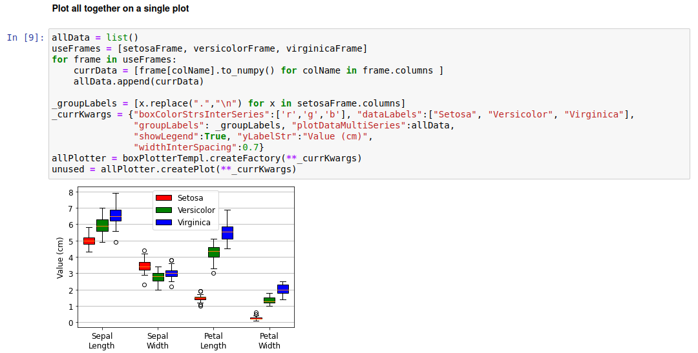
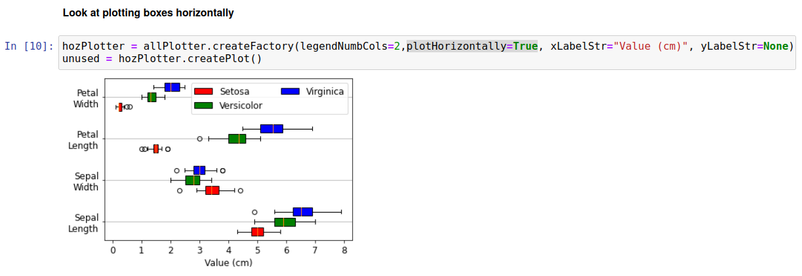
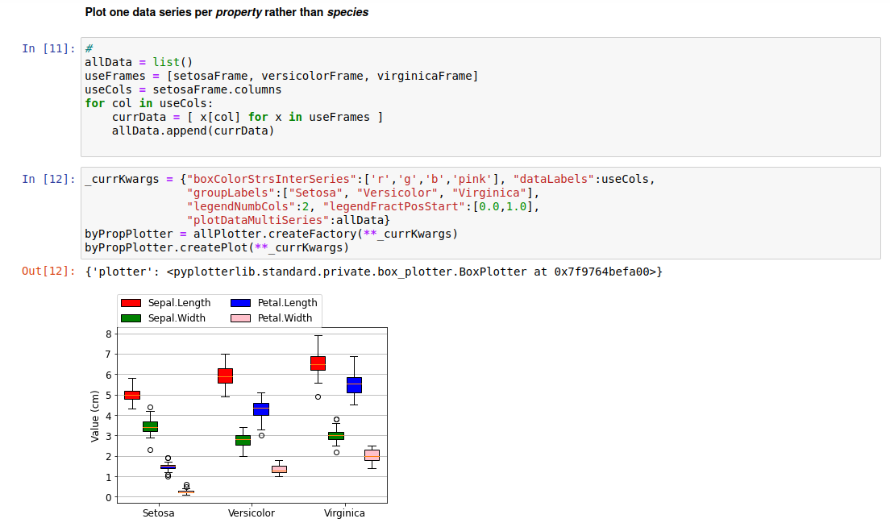
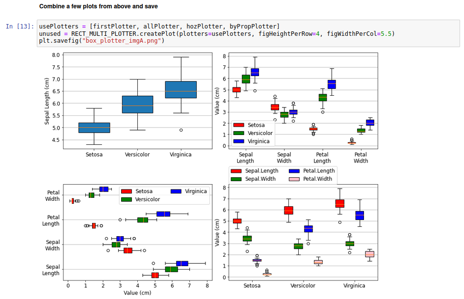

Box Plotter
===========

Added in v1.3.0

Introduction
------------

A box plot (also called a box and whisker plot) provides a concise, visual summary of a statistical distribution. Below, these plots are used with the "iris" dataset; each row contains four parameters describing irises (petal length, petal width, sepal length, sepal width) and a label of the species (setosa, versicolor, and virginica). This dataset is commonly used as a simple test case for machine learning models, where the goal is to predict the species based on the petal/sepal parameters.

Processing Data
----------------

The iris dataset is imported as follows:

We're interested in the overall distribution of petal/sepal length/width for each species. Thus, it is practical to extract a separate dataframe for each species label as follows:

.. image:: images/box_plotter_a/data_proc_b.png

Plotting (Single Data Series) / Meaning of the plot elements
------------------------------------------------------------

The code below demonstrates how to create a box plot showing how sepal length varies between the three species of irises:

The meanings of box and whisker lengths reflect the default matplotlib behavior. At time of writing (matplotlib version 3.5.2) the meanings are as follows: i) the orange line across each box is represents the median value, ii) the box encloses values between the first quartile and third quartile (*i.e* half the data lies within this box), iii) whiskers are drawn from the box to +-1.5 times the interquartile range, with the further restriction that they must terminate at a datapoint, iv) markers are drawn to explicitly show outliers, such as the point at 5cm Sepal length for the Virginica species.

The plot above shows that the sepal length generally increases as setosa < versicolor < virginica. This could also easily be seen by simply looking at the means or median for each species. However, the use of a box plot further shows the significant overlap between sepal lengths of setosa/versicolor and versicolor/virginica; compared to just looking at the average values this more clearly illustrates the degree to which species can be separated based on sepal length.

Below we create similar plots for *each* of the input properties. Note that we simply pass an array of datapoints for each box to produce these plots (matplotlib automatically calculates the relevant averages and quartile ranges). 

These plots lead to various insights, but for brevity we will just focus on one aspect of the bottom two plots. These clearly show that either petal length or petal width can be used to separate the setosa species from versicolor/virginica; for example, a petal length < 2 cm means the iris will be of species setosa.

Plotting (Multiple Data Series)
-------------------------------

While the above plots give significant insights into the distributions of iris properties, the need for four separate plots to do so is inefficient. A different approach is to use a single plot, with different properties along the x-axis and using color to differentiate the distributions of each species. In this case we treat data for each species as a data series, and need to use the "plotDataMultiSeries" keyword to pass the input plot data. This involves passing a list where each element in turn contains an iterable of arrays (1 array per property). The code to do this is shown below:

Another way of plotting this is to have the bars stretch along the x-axis, whilst the group labels are placed on the y-axis. This can be accomplished simply by passing plotHorizontally=True, as shown below:

A further way to plot the data is to use the species as group labels, and have a separate data series for each property. This is shown below:

Side-by-Side Plots
------------------

Various of the plots from above can be compared side-by-side as follows:

Raw Code
--------

::

	import matplotlib.pyplot as plt #For saving figures
	import pandas as pd
	import pydataset
	import pyplotterlib.standard.plotters as ppl
	
	_currKwargs = {"constrainedLayout":True, "figHeightPerRow":2, "figWidthPerCol":5, "nColsGrid":2}
	RECT_MULTI_PLOTTER = ppl.RectMultiPlotter(**_currKwargs)
	
	DF = pydataset.data("iris")
	DF.head(2)
	
	setosaFrame = DF.loc[DF["Species"]=="setosa"].drop("Species",axis=1)
	versicolorFrame = DF.loc[DF["Species"]=="versicolor"].drop("Species",axis=1)
	virginicaFrame = DF.loc[DF["Species"]=="virginica"].drop("Species",axis=1)
	virginicaFrame.head(2)
	
	_currKwargs = {"boxColorsOn":True, "fontSizeDefault":12 , "gridLinesShowY":True,
	               "groupLabels":["Setosa", "Versicolor", "Virginica"], "widthInterSpacing":0.1}
	boxPlotterTempl = ppl.BoxPlotter(**_currKwargs)
	
	plotData = [ x["Sepal.Length"].to_numpy() for x in [setosaFrame, versicolorFrame, virginicaFrame] ]
	firstPlotter = boxPlotterTempl.createFactory(plotDataSingleSeries=plotData, yLabelStr = "Sepal Length (cm)")
	unused = firstPlotter.createPlot()
	
	boxPlotters = list()
	for colName in setosaFrame.columns:
	    currData = [x[colName].to_numpy() for x in [setosaFrame, versicolorFrame, virginicaFrame] ]
	    titleStr = colName.replace(".", " ")
	    _currKwargs = {"plotDataSingleSeries":currData, "titleStr":titleStr, "yLabelStr":titleStr + " (cm)"}
	    currPlotter = boxPlotterTempl.createFactory(**_currKwargs)
	    boxPlotters.append(currPlotter)
	
	unused = RECT_MULTI_PLOTTER.createPlot(plotters=boxPlotters)
	
	allData = list()
	useFrames = [setosaFrame, versicolorFrame, virginicaFrame]
	for frame in useFrames:
	    currData = [frame[colName].to_numpy() for colName in frame.columns ]
	    allData.append(currData)
	
	_groupLabels = [x.replace(".","\n") for x in setosaFrame.columns]    
	_currKwargs = {"boxColorStrsInterSeries":['r','g','b'], "dataLabels":["Setosa", "Versicolor", "Virginica"],
	               "groupLabels": _groupLabels, "plotDataMultiSeries":allData,
	               "showLegend":True, "yLabelStr":"Value (cm)",
	               "widthInterSpacing":0.7}
	allPlotter = boxPlotterTempl.createFactory(**_currKwargs)
	unused = allPlotter.createPlot(**_currKwargs)
	
	hozPlotter = allPlotter.createFactory(legendNumbCols=2,plotHorizontally=True, xLabelStr="Value (cm)", yLabelStr=None)
	unused = hozPlotter.createPlot()
	
	
	allData = list()
	useFrames = [setosaFrame, versicolorFrame, virginicaFrame]
	useCols = setosaFrame.columns
	for col in useCols:
	    currData = [ x[col] for x in useFrames ]
	    allData.append(currData)
	
	_currKwargs = {"boxColorStrsInterSeries":['r','g','b','pink'], "dataLabels":useCols,
	               "groupLabels":["Setosa", "Versicolor", "Virginica"],
	               "legendNumbCols":2, "legendFractPosStart":[0.0,1.0],
	               "plotDataMultiSeries":allData}
	byPropPlotter = allPlotter.createFactory(**_currKwargs)
	byPropPlotter.createPlot(**_currKwargs)
	
	
	usePlotters = [firstPlotter, allPlotter, hozPlotter, byPropPlotter]
	unused = RECT_MULTI_PLOTTER.createPlot(plotters=usePlotters, figHeightPerRow=4, figWidthPerCol=5.5)
	plt.savefig("box_plotter_imgA.png")

