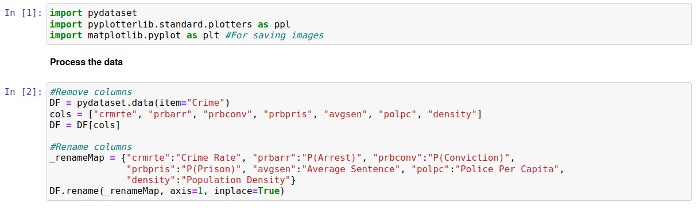
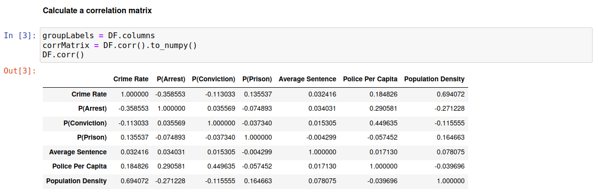
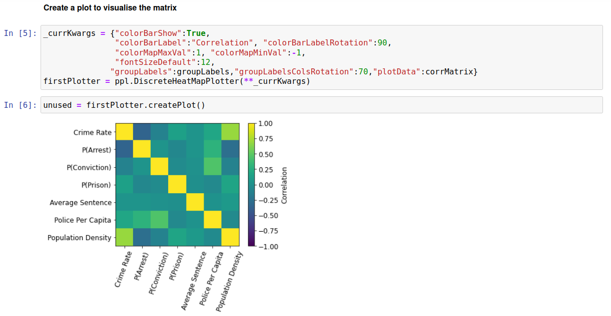
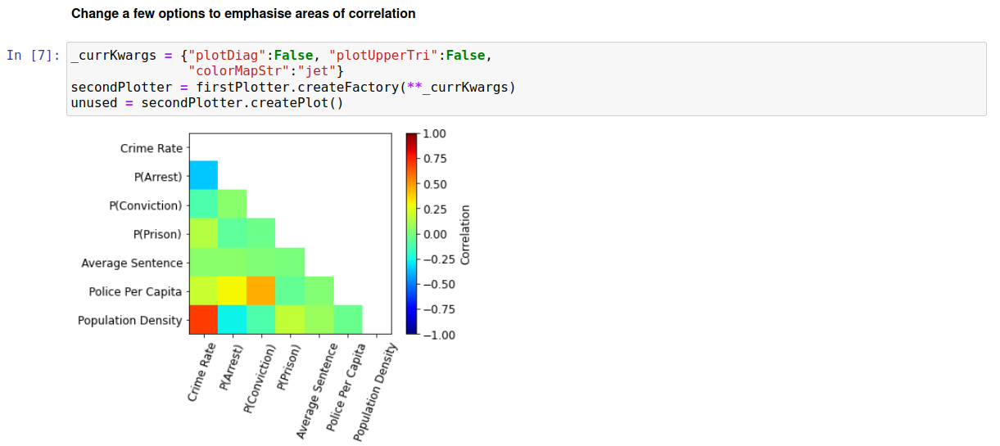
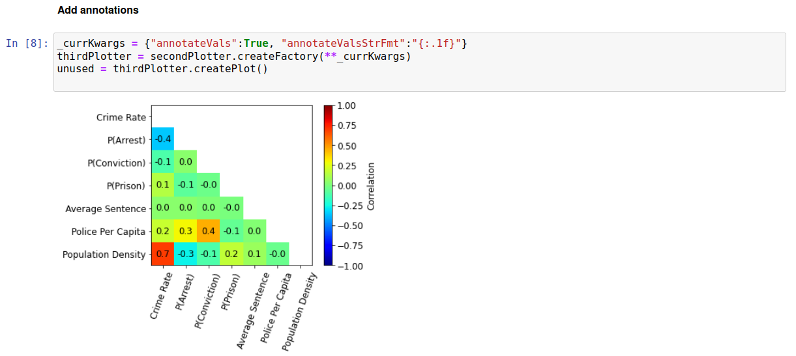
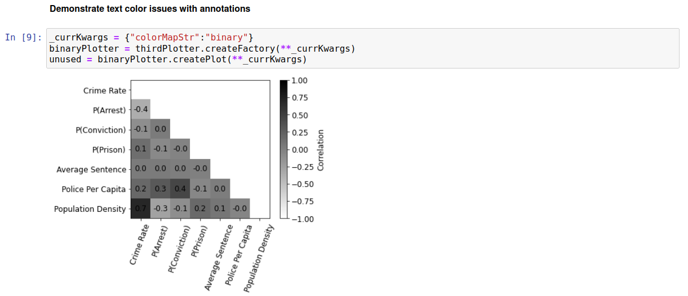
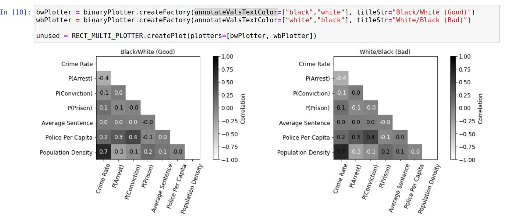
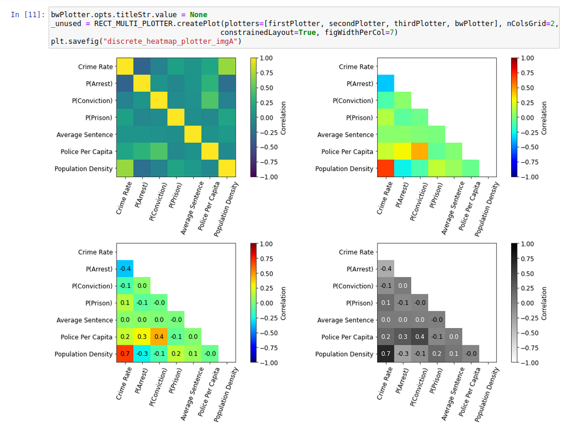

Discrete Heatmap Plotter
========================

Added in v1.2.0

Introduction
------------

This plotter is analogous to a heatmap plotter, except that the data along x/y is for discrete groups rather than for a single continous variable. It is mainly meant for visualizing data in matrices, such as correlation or confusion matrices. Its behavior is demonstrated below using the "Crime" dataset from pydataset. This contains various information relating to crime for counties in North Carolina in the 1981 to 1987 period. We will calculate a correlation matrix for select fields, and visualize it using "DiscreteHeatMapPlotter" with various options set.

Processing Data
---------------

In terms of processing, we first select only a subset of the data in order to keep this example simple. We subsequently relabel some of the columns, to make their meaning clearer. Finally we calculate a Pearson correlation matrix. This expresses correlations using values between 1 and -1 with the following meanings for the extreme cases: i) a value of zero means the values are completely linearly-uncorrelated; ii) A value of 1.0 means there exists a perfect positive linear correlation (y= mx + c, where m is positive); iii) A value of -1.0 means there exists a perfect negative linear correlation (y=mx + c, where m is negative). Thus, we are generally interested in high magnitude values. To aid interpretation, it can be useful to visualise these matrices in a way that allows us to easily see the large-correlations; this is especially true for larger matrices. The processing code and a print out of the correlation matrix is shown below.

Plotting Data
-------------

Before plotting the matrix, we briefly setup a plotter for displaying multiple plots in a grid; this will be useful later.

Next, we use the "DiscreteHeatMapPlotter" plotter with some basic options to create a visualization of our correlation matrix.

Assuming the goal is to quickly spot areas of high-correlation, this can be improved in various ways. Firstly, there is no particular need to plot the diagonal elements since these are always equal to 1. Furthermore, we only need to plot half the non-diagonal matrix elements, due to the symmetry of the correlation matrix. Finally, other colormaps will highlight areas of high-correlation better. We can modify the plotter to better highlight correlations as shown below:

This makes it simpler to see certain strong correlations; for example, there is clearly a strong positive correlation between population density and crime rate (with the natural interpretation being that higher population density leads to a higher crime rate). However, it is difficult to determine the numerical values of these correlations by just looking at the colorbar. To solve this we can add annotations showing the value of each correlation as follows:

This now allows high-correlation relationships to be quickly identified *and* their numerical values to be easily read.

Annotations - Text Color Issues
-------------------------------

It is worth looking at a possible issue (and its solution) for annotation text colors. A single text color will generally show up more clearly for some values than others; this is demonstrated below using the "black" text color for a "binary" colormap:

It is particularly difficult to see the correlation between crime rate and population density in this plot. These types of problems are common when using a single color for displaying text. The general solution we use is to employ different color text based on the position we are in the colormap. In the above example, white text will show best for high positive-correlation values whilst black text will show best for negative-correlation values. We can get this colormap-dependent text colors by simply passing multiple colors to the "annotateValsTextColor" argument. Using two colors means i) the lower half of the colormap uses the first color, ii) the upper half of the colormap uses the second color. Similarly, if using three colors we equally divide them between thirds of the colormap. The behavior for two colors is best demonstrated by an example, as shown below:

The left plot shows this approach working well, with all annotations clearly visible. The right hand plot demonstrates the effect of swapping the order of "annotateValsTextColor" values.

Side-By-Side Plots
------------------

Below shows select plots created above. All show the same underlying data, but the bottom-left plot makes it easiest to quickly identify and quantify the strongest correlations (in my opinion).

Raw Code
--------

Shown below.::

	import pydataset
	import pyplotterlib.standard.plotters as ppl
	import matplotlib.pyplot as plt #For saving images
	
	DF = pydataset.data(item="Crime")
	cols = ["crmrte", "prbarr", "prbconv", "prbpris", "avgsen", "polpc", "density"]
	DF = DF[cols]
	
	_renameMap = {"crmrte":"Crime Rate", "prbarr":"P(Arrest)", "prbconv":"P(Conviction)",
	              "prbpris":"P(Prison)", "avgsen":"Average Sentence", "polpc":"Police Per Capita",
	              "density":"Population Density"}
	DF.rename(_renameMap, axis=1, inplace=True)
	
	
	groupLabels = DF.columns
	corrMatrix = DF.corr().to_numpy()
	DF.corr()
	
	
	_currKwargs = {"figHeightPerRow":5, "figWidthPerCol":7, "nColsGrid":2, "constrainedLayout":True}
	RECT_MULTI_PLOTTER = ppl.RectMultiPlotter(**_currKwargs)
	
	
	_currKwargs = {"colorBarShow":True,
	               "colorBarLabel":"Correlation", "colorBarLabelRotation":90,
	               "colorMapMaxVal":1, "colorMapMinVal":-1,
	               "fontSizeDefault":12,
	              "groupLabels":groupLabels,"groupLabelsColsRotation":70,"plotData":corrMatrix}
	firstPlotter = ppl.DiscreteHeatMapPlotter(**_currKwargs)
	unused = firstPlotter.createPlot()
	`
	
	_currKwargs = {"plotDiag":False, "plotUpperTri":False,
	               "colorMapStr":"jet"}
	secondPlotter = firstPlotter.createFactory(**_currKwargs)
	unused = secondPlotter.createPlot()
	
	
	_currKwargs = {"annotateVals":True, "annotateValsStrFmt":"{:.1f}"}
	thirdPlotter = secondPlotter.createFactory(**_currKwargs)
	unused = thirdPlotter.createPlot()
	
	
	_currKwargs = {"colorMapStr":"binary"}
	binaryPlotter = thirdPlotter.createFactory(**_currKwargs)
	unused = binaryPlotter.createPlot(**_currKwargs)
	
	
	bwPlotter = binaryPlotter.createFactory(annotateValsTextColor=["black","white"], titleStr="Black/White (Good)")
	wbPlotter = binaryPlotter.createFactory(annotateValsTextColor=["white","black"], titleStr="White/Black (Bad)")
	unused = RECT_MULTI_PLOTTER.createPlot(plotters=[bwPlotter, wbPlotter])
	
	
	bwPlotter.opts.titleStr.value = None
	_unused = RECT_MULTI_PLOTTER.createPlot(plotters=[firstPlotter, secondPlotter, thirdPlotter, bwPlotter], nColsGrid=2,
	                                       constrainedLayout=True, figWidthPerCol=7)
	plt.savefig("discrete_heatmap_plotter_imgA")
	

