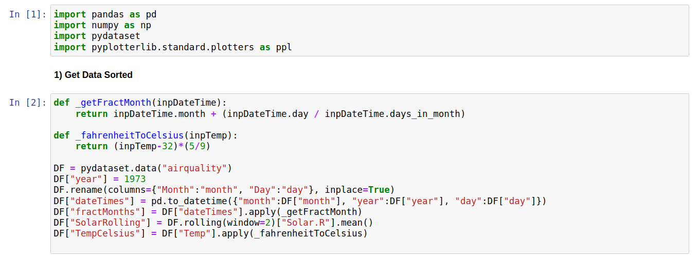
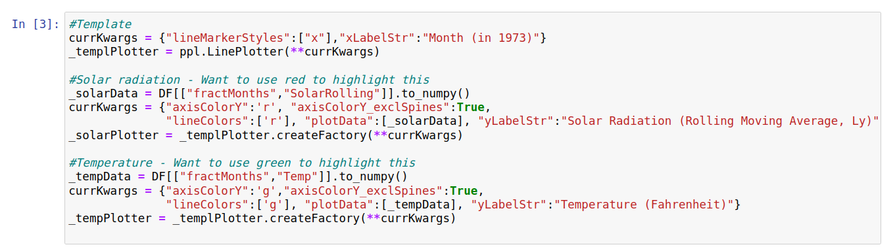
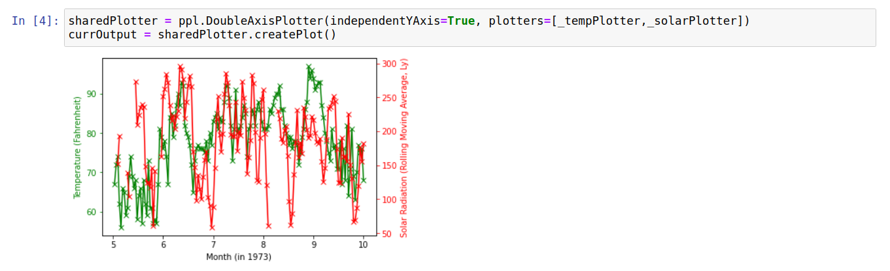
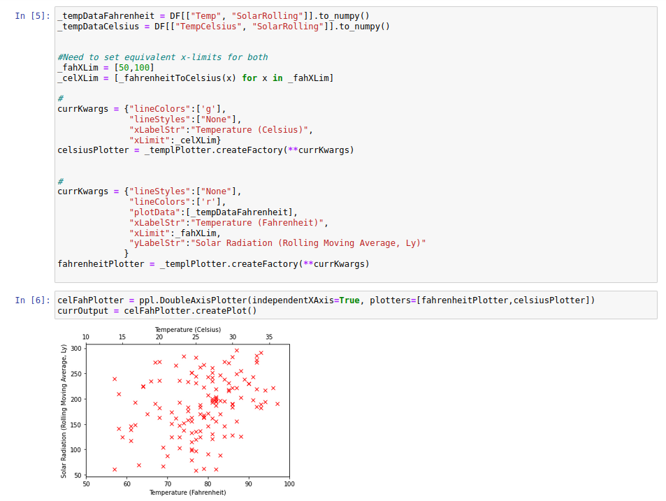

Double Axis Plotter
===================

Introduction
------------
A "double axis" plot involves plotting two data series in the same area where i) they share the x-axis but have independent y-axes, or ii) they share the y-axis, but have independent x-axes. Case i) can be useful when you have two data series for different types of measurement which you suspect may be correlated. Case ii) can be useful for showing the independent variable in two different units. We demonstrate both these use-cases below using the "airquality" dataset from the pydataset library. More specifically, we plot solar radiation and temperature measurements taken across a series of months in New York 1973.

Processing Data
---------------

As with a previous example, we start by generating a column which expresses month and day as a decimal number. We also generate columns with i) The three-day rolling average solar radiation, and ii) the temperature in Celsius (the original temperature column is in Fahrenheit). The code to do this is shown below.

Plotting Data
-------------

Our first goal is to show variations in temperature and solar radiation on the same plot. To do this, we first create individual plotters for each. When creating these we take the unusual step (in the case of individual plots) of changing the color of the y-axes to match the color of the data markers. This will make it easier to determine which data belongs to which y-axis below.

To create a plot with two independent y-axes we pass the plotters to the "DoubleAxisPlotter" class, along with a keyword specifying that we want each to be plotted with independent y-axes. This leads to the plot below:

This allows us to visually inspect the degree to which the temperature variations follow (or don't) variations in the solar radiation values. Another way to probe the relationship between these measurements is to create a scatter plot showing temperature against solar radiation. In this case, we can exploit the DoubleAxisPlotter to show temperature values in both Fahrenheit and Celsius. The code to carry this out is shown below:

Raw Code
--------

The raw code for creating the plots on this page is given below::

	import pandas as pd
	import numpy as np
	import pydataset
	import pyplotterlib.standard.plotters as ppl
		
	def _getFractMonth(inpDateTime):
	    return inpDateTime.month + (inpDateTime.day / inpDateTime.days_in_month)
	
	def _fahrenheitToCelsius(inpTemp):
	    return (inpTemp-32)*(5/9)
	
	DF = pydataset.data("airquality")
	DF["year"] = 1973
	DF.rename(columns={"Month":"month", "Day":"day"}, inplace=True)
	DF["dateTimes"] = pd.to_datetime({"month":DF["month"], "year":DF["year"], "day":DF["day"]})
	DF["fractMonths"] = DF["dateTimes"].apply(_getFractMonth)
	DF["SolarRolling"] = DF.rolling(window=3)["Solar.R"].mean()
	DF["TempCelsius"] = DF["Temp"].apply(_fahrenheitToCelsius)
	
	
	currKwargs = {"lineMarkerStyles":["x"],"xLabelStr":"Month (in 1973)"}
	_templPlotter = ppl.LinePlotter(**currKwargs)
	
	_solarData = DF[["fractMonths","SolarRolling"]].to_numpy()
	currKwargs = {"axisColorY":'r', "axisColorY_exclSpines":True,
	              "lineColors":['r'], "plotData":[_solarData], "yLabelStr":"Solar Radiation (Rolling Moving Average, Ly)"}
	_solarPlotter = _templPlotter.createFactory(**currKwargs)
	
	_tempData = DF[["fractMonths","Temp"]].to_numpy()
	currKwargs = {"axisColorY":'g',"axisColorY_exclSpines":True,
	              "lineColors":['g'], "plotData":[_tempData], "yLabelStr":"Temperature (Fahrenheit)"}
	_tempPlotter = _templPlotter.createFactory(**currKwargs)
	
	
	sharedPlotter = ppl.DoubleAxisPlotter(independentYAxis=True, plotters=[_tempPlotter,_solarPlotter])
	currOutput = sharedPlotter.createPlot()
	
	_tempDataFahrenheit = DF[["Temp", "SolarRolling"]].to_numpy()
	_tempDataCelsius = DF[["TempCelsius", "SolarRolling"]].to_numpy()
	_fahXLim = [50,100]
	_celXLim = [_fahrenheitToCelsius(x) for x in _fahXLim]
	
	currKwargs = {"lineColors":['g'],
	              "lineStyles":["None"],
	              "xLabelStr":"Temperature (Celsius)",
	              "xLimit":_celXLim}
	celsiusPlotter = _templPlotter.createFactory(**currKwargs)
	
	currKwargs = {"lineStyles":["None"],
	              "lineColors":['r'],
	              "plotData":[_tempDataFahrenheit],
	              "xLabelStr":"Temperature (Fahrenheit)",
	              "xLimit":_fahXLim,
	              "yLabelStr":"Solar Radiation (Rolling Moving Average, Ly)"
	             }
	fahrenheitPlotter = _templPlotter.createFactory(**currKwargs)
	
	celFahPlotter = ppl.DoubleAxisPlotter(independentXAxis=True, plotters=[fahrenheitPlotter,celsiusPlotter])
	currOutput = celFahPlotter.createPlot()
	

