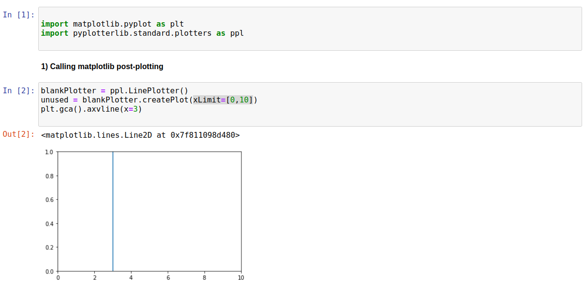
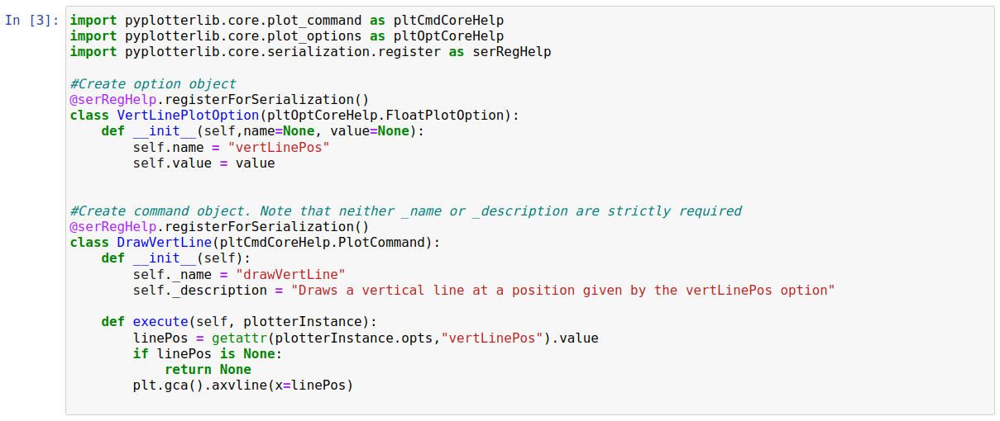
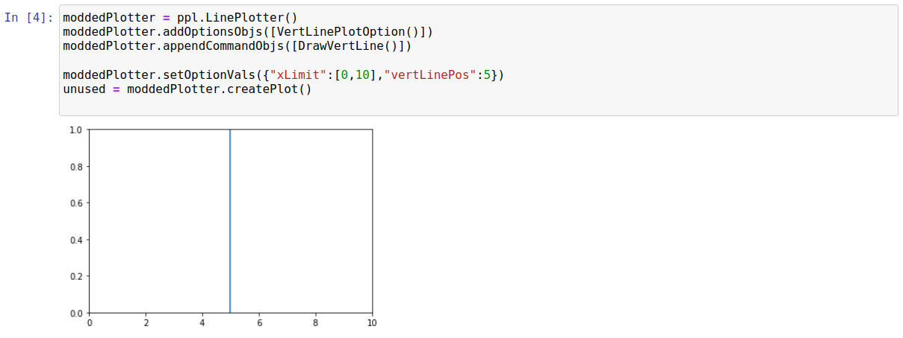
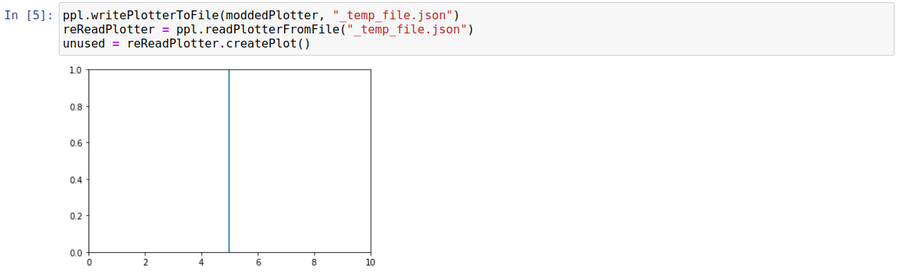
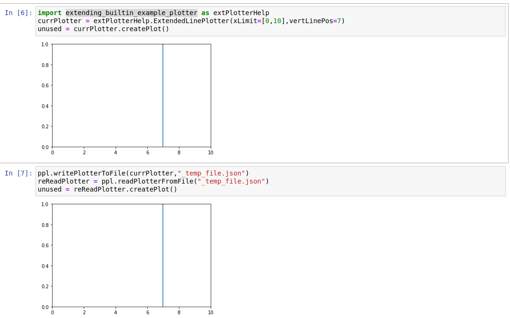

Extending Built-in Functionality
================================

Introduction
------------

If you want to change some aspect of a plot, but there is no corresponding option on the plotter then it may be neccesary to access the backend matplotlib directly. On this page we look at multiple ways to extend the built-in features of the LinePlotter, using the toy example of adding a vertical line at a specific position on the x-axis.

Calling Matplotlib Post-Plot ("plot-level" modification)
--------------------------------------------------------

If a single plot is being created, then the active *axis* and *figure* on matplotlib will be those corresponding to this plot (note: if using a jupyter notebook the active axis/figure may reset between cells). Thus, the simplest way to add a vertical line to a plot can be demonstrated as follows:

This approach has the advantage of being simple, but the disadvantage of *not* modifiying the plotter itself which makes it inappropriate for many use-cases. Essentially, this is the method to use if you only need extra functionality *for a single plot*.

Appending Custom Commands ("plotter-instance-level modification")
-----------------------------------------------------------------

A more involved approach is to modify a plotter instance itself. It is worth mentioning that a plotter consists of i) a group of configuration options, ii) a list of command objects which are executed in sequence. The identity of the option and command objects are essentially what differentiates plotters (*e.g.* a bar plotter has a different set of command objects to a line plotter).

For our toy case we would like an option to control where the vertical line is drawn, and we also need a command object which handles the actual drawing. The code to create these objects is shown below:

We then need to attach the option/command object onto the plotter before creating our plot. This is simple to do, as demonstrated below:

This method is more persistent than the "plot-level" modification shown above. Essentially, this is the method to use if you only need extended functionality *for a single notebook*.

A note on serialization
^^^^^^^^^^^^^^^^^^^^^^^
Note, we have also applied the "serRegHelp.registerForSerialization" decorator to each class. This is neccesary for reading/writing of plotters to files. Note that this decorator has to run to *either* read or write a plotter containing these objects. Thus, if we define a new option in *file A* and write to a file, we cant parse from *file B* without first importing *file A* (which contains the definition of the new option). A practical result of this is: **dont define new options/commands in notebooks if you plan to use serialization** (since notebooks cant be imported).

Having said that, we can read and write this modified plotter within the current notebook:

Creating Custom Plotters ("plotter-class-level modification")
-------------------------------------------------------------

If you often require extra-features to those built in, then creating a custom plotter *class* is likely the solution. The process is essentially the same as was used to create the built-in plotters. An example of a line plotter that also has an option for drawing a vertical line is as follows::

	#extending_builtin_example_plotter.py
	import matplotlib.pyplot as plt
	import pyplotterlib.core.plot_command as pltCmdCoreHelp
	import pyplotterlib.core.plot_options as pltOptCoreHelp
	import pyplotterlib.core.serialization.register as serRegHelp
	
	import pyplotterlib.standard.plotters as ppl
	
	#Create the plotter itself
	@serRegHelp.registerForSerialization()
	class ExtendedLinePlotter(ppl.LinePlotter):
	
		def __init__(self, **kwargs):
			super().__init__() #Generates instance with same functionality as Parent class
			self.addOptionsObjs([VertLinePlotOption()])
			self.setOptionVals(kwargs)
	
			#I COULD just append the command, but will put it earlier for demo-reasons
			outCommands = self._commands
			outCommands.insert(-2, DrawVertLine()) #Now the third last command
			self._commands = outCommands
	
	
	#Create option object
	@serRegHelp.registerForSerialization()
	class VertLinePlotOption(pltOptCoreHelp.FloatPlotOption):
	    def __init__(self,name=None, value=None):
	        self.name = "vertLinePos"
	        self.value = value
	
	#Create command object. Note that neither _name or _description are strictly required
	@serRegHelp.registerForSerialization()
	class DrawVertLine(pltCmdCoreHelp.PlotCommand):
	    def __init__(self):
	        self._name = "drawVertLine"
	        self._description = "Draws a vertical line at a position given by the vertLinePos option"
	    
	    def execute(self, plotterInstance):
	        linePos = getattr(plotterInstance.opts,"vertLinePos").value
	        if linePos is None:
	            return None
	        plt.gca().axvline(x=linePos)
	
Using this plotter, including the serialization (read/write), simply requires that the relevant file is imported, as shown below:

This method of extending functionality is the most persistent of those presented on this page. It is recommended *if you need extra functionality across multiple notebooks*.

