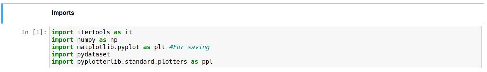
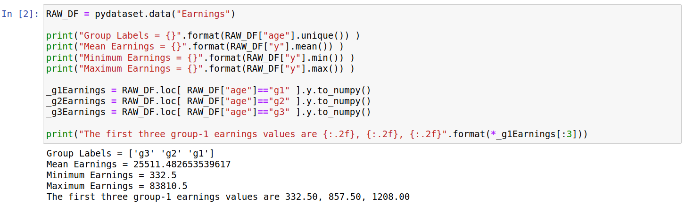
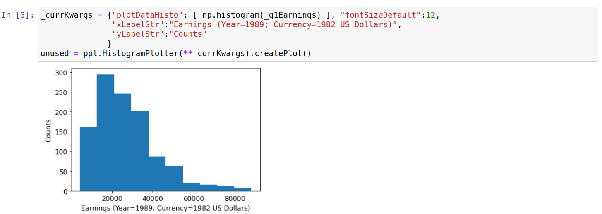
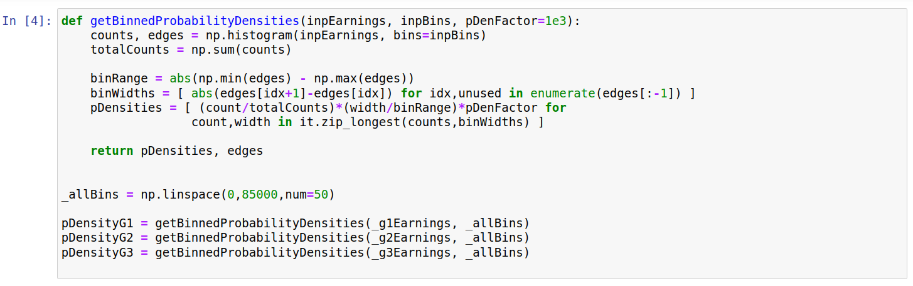
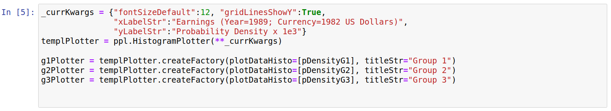
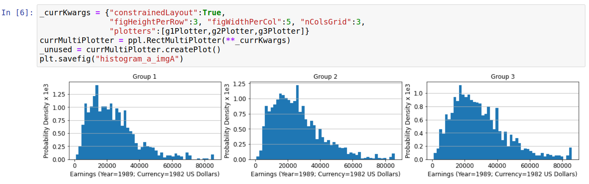
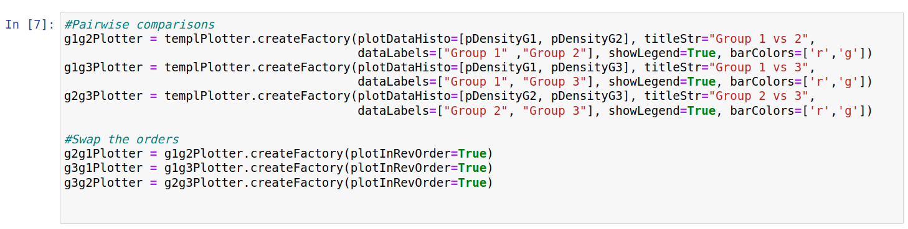
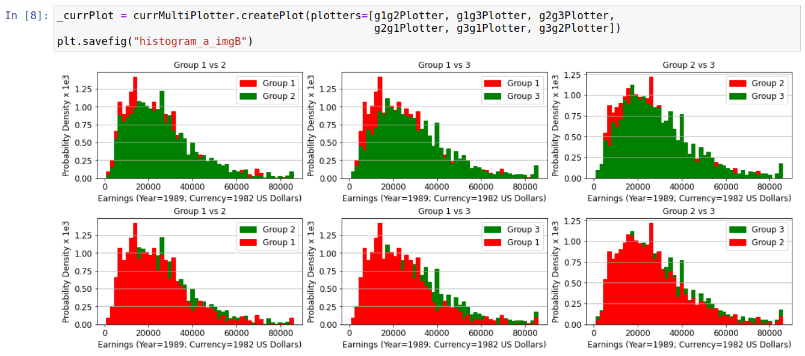

Histogram Plotter
=================

Introduction
------------

Histograms are often convenient for visualizing sampled probability distributions, leading to a more intuitive understanding than can be obtained from the moments (mean, variance, skew, etc.). In the example below, the earning distributions for various age groups in 1989 are visualized using histograms. In terms of probability distributions, they effectively answer the question "Given a random person in age group *X* (in the USA in 1989), what is the probability their income is *Y*?". How accurately they can really answer this question obviously depends on factors outside the scope of this example (*e.g.* on how the data was collected); here we just focus on how to visualize the distributions.

Importing Data
--------------

The code below shows the data being imported into a pandas dataframe; we also print some basic information from the dataset. The age groups are divided by three strings "g1", "g2", and "g3"; as far as I can tell these correspond to ages "19-26", "27-29", and "30-32" respectively. The earnings are in 1982 US dollars.

Creating Histograms
-------------------

To create a histogram we first need to bin the data. The format that the HistogramPlotter takes for each *dataset* is [counts,edges]; where edges refers to increasing bin edges (*e.g.* [1,2,3] corresponds to two bins) while counts refers to the y-value for this bin (*e.g.* [10,14] corresponds to values for two bins). This was chosen as its also the format that is returned by the numpy.histogram function; thus, we can generate a simple histogram for one dataset as follows:

This gives some insight into the distribution of earnings, but the y-values correspond only to the number of sampled people falling between the relevant limits. This makes it hard to compare distributions between the age groups. Thus, we convert these values into probability densities below. Understanding this code isnt particularly important for the plots below, and it is included mainly for completeness.

Below we first create three plotters, one for each age group. Most settings are shared between them, and (at time of writing) only the plotDataHisto option is unique to the HistogramPlotter class. 

We next visualize each of the histograms side-by-side using the "RectMultiPlotter" class. 

This allows us to compare the approximate shapes of the three distributions. In each case we have a peak at around 20000 dollars, with a long tail extending to higher values. We can get a better idea of how the distributions differ if they are plotted on the same axis. However, plotting both on one axis means one histogram will partly cover the other. We partly get round this below by plotting each pair in two ways; for example we plot the pair "Group 1" and "Group 2" with i) "Group 2" plotted over "Group 1", and ii) "Group 1" plotted over "Group 2". We can reverse the plotting order simply by setting the "plotInRevOrder" keyword to True, as shown below:

This leads to the top row plots being plotted in the opposite order to the bottom row, as shown below:

The leftmost plots (both top and bottom) show the differences between Group 1 and Group 2. The top plot shows that Group 1 has more density at values below 20000 dollars, whilst the bottom plot shows Group 2 has higher probability density around 40000 dollars. Similarly, differences between Group 1/3 and Group 2/3 can be seen by looking at the middle and rightmost plots.

Raw Code
--------

::

	import itertools as it
	import numpy as np
	import matplotlib.pyplot as plt #For saving
	import pydataset
	import pyplotterlib.standard.plotters as ppl
	
	
	RAW_DF = pydataset.data("Earnings")
	
	print("Group Labels = {}".format(RAW_DF["age"].unique()) )
	print("Mean Earnings = {}".format(RAW_DF["y"].mean()) )
	print("Minimum Earnings = {}".format(RAW_DF["y"].min()) )
	print("Maximum Earnings = {}".format(RAW_DF["y"].max()) )
	
	_g1Earnings = RAW_DF.loc[ RAW_DF["age"]=="g1" ].y.to_numpy()
	_g2Earnings = RAW_DF.loc[ RAW_DF["age"]=="g2" ].y.to_numpy()
	_g3Earnings = RAW_DF.loc[ RAW_DF["age"]=="g3" ].y.to_numpy()
	
	print("The first three group-1 earnings values are {:.2f}, {:.2f}, {:.2f}".format(*_g1Earnings[:3]))
	
	
	_currKwargs = {"plotDataHisto": [ np.histogram(_g1Earnings) ], "fontSizeDefault":12,
	               "xLabelStr":"Earnings (Year=1989; Currency=1982 US Dollars)",
	               "yLabelStr":"Counts"
	              }
	unused = ppl.HistogramPlotter(**_currKwargs).createPlot()
	
	
	def getBinnedProbabilityDensities(inpEarnings, inpBins, pDenFactor=1e3):
	    counts, edges = np.histogram(inpEarnings, bins=inpBins)
	    totalCounts = np.sum(counts)
	    
	    binRange = abs(np.min(edges) - np.max(edges))
	    binWidths = [ abs(edges[idx+1]-edges[idx]) for idx,unused in enumerate(edges[:-1]) ]
	    pDensities = [ (count/totalCounts)*(width/binRange)*pDenFactor for
	                  count,width in it.zip_longest(counts,binWidths) ]
	
	    return pDensities, edges
	        
	_allBins = np.linspace(0,85000,num=50)
	
	pDensityG1 = getBinnedProbabilityDensities(_g1Earnings, _allBins)
	pDensityG2 = getBinnedProbabilityDensities(_g2Earnings, _allBins)
	pDensityG3 = getBinnedProbabilityDensities(_g3Earnings, _allBins)
	
	
	_currKwargs = {"fontSizeDefault":12, "gridLinesShowY":True,
	               "xLabelStr":"Earnings (Year=1989; Currency=1982 US Dollars)",
	               "yLabelStr":"Probability Density x 1e3"}
	templPlotter = ppl.HistogramPlotter(**_currKwargs)
	
	g1Plotter = templPlotter.createFactory(plotDataHisto=[pDensityG1], titleStr="Group 1")
	g2Plotter = templPlotter.createFactory(plotDataHisto=[pDensityG2], titleStr="Group 2")
	g3Plotter = templPlotter.createFactory(plotDataHisto=[pDensityG3], titleStr="Group 3")
	
	
	_currKwargs = {"constrainedLayout":True,
	               "figHeightPerRow":3, "figWidthPerCol":5, "nColsGrid":3,
	               "plotters":[g1Plotter,g2Plotter,g3Plotter]}
	currMultiPlotter = ppl.RectMultiPlotter(**_currKwargs)
	_unused = currMultiPlotter.createPlot()
	plt.savefig("histogram_a_imgA")
	
	
	g1g2Plotter = templPlotter.createFactory(plotDataHisto=[pDensityG1, pDensityG2], titleStr="Group 1 vs 2",
	                                         dataLabels=["Group 1" ,"Group 2"], showLegend=True, barColors=['r','g'])
	g1g3Plotter = templPlotter.createFactory(plotDataHisto=[pDensityG1, pDensityG3], titleStr="Group 1 vs 3",
	                                         dataLabels=["Group 1", "Group 3"], showLegend=True, barColors=['r','g'])
	g2g3Plotter = templPlotter.createFactory(plotDataHisto=[pDensityG2, pDensityG3], titleStr="Group 2 vs 3",
	                                         dataLabels=["Group 2", "Group 3"], showLegend=True, barColors=['r','g'])
	
	g2g1Plotter = g1g2Plotter.createFactory(plotInRevOrder=True)
	g3g1Plotter = g1g3Plotter.createFactory(plotInRevOrder=True)
	g3g2Plotter = g2g3Plotter.createFactory(plotInRevOrder=True)
	
	
	_currPlot = currMultiPlotter.createPlot(plotters=[g1g2Plotter, g1g3Plotter, g2g3Plotter,
	                                                  g2g1Plotter, g3g1Plotter, g3g2Plotter])
	plt.savefig("histogram_a_imgB")
	
	

