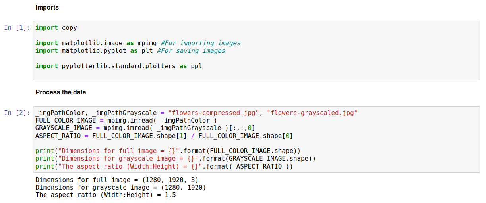
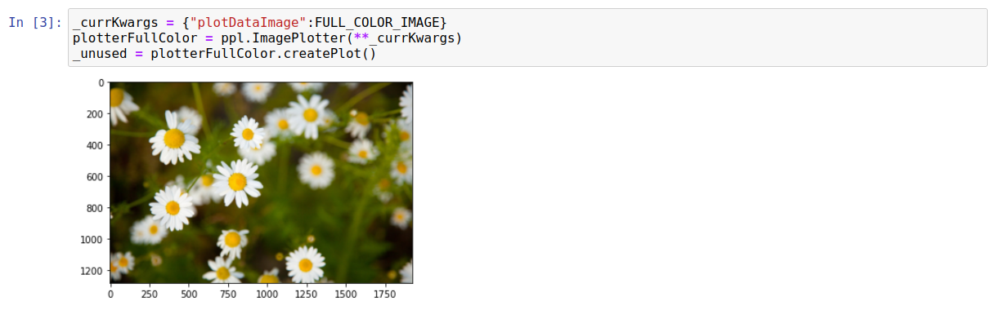
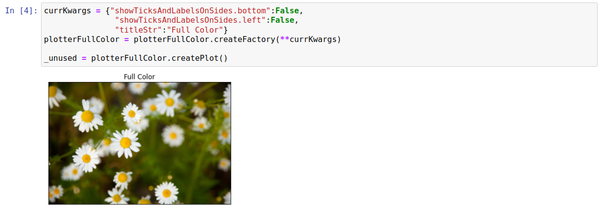
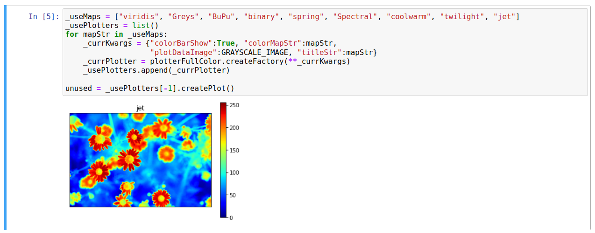
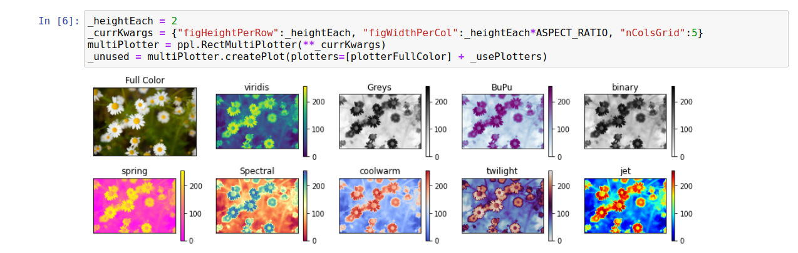
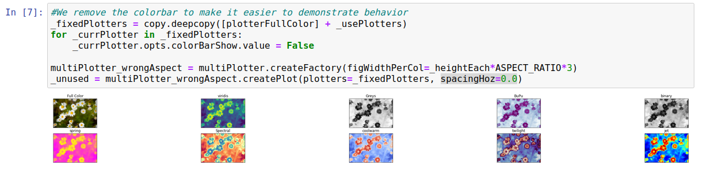
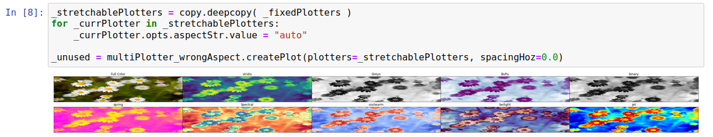

Image Plotter
=============

Introduction
------------

It is often convenient to use plotting libraries to display images. In this example, we use a simple image of a group of flowers [#f1]_, which we display in both its native state (full-color) and grayscale with various color mappings applied. This is essentially a toy example, chosen to show select features of plotting images.

Importing Data
--------------

We use a matplotlib function to read .jpg files into arrays of pixels. For the color image, we have dimensions 1280x1920x3; the first two dimensions refer to pixels (column, row) whilst the third dimension refers to RGB. For the grayscale image we have a 1280x1920 array, since the R/G/B values at each pixel are equal and can hence be compressed to a single number. Note that these formats are those required for matplotlibs imshow function, which we use as the backend.

Plotting Individual Images
--------------------------

Individual images can be plotted by simply passing in the "plotDataImage" value:

The x/y ticks indicate the pixel indices. These will often be unwanted; below we create a plotter with tick markers/labels turned off, and also a title string added.

Plotting Image Grids
--------------------

Using a plotting library can provide a simple (and likely limited) way of tiling images in a grid. We can use the standard "RectMultiPlotter" class for this, though some care may be needed when setting the dimensions; as will be demonstrated below.

The first step is to generate a set of images to arrange in a grid. We will primarily use the grayscale image for this purpose, and look at varying ways of mapping grayscale images to color. The first step is to generate a series of plotters with different mappings; this is shown below, with the plot corresponding to the "jet" mapping below:

Note, that the available color mappings come directly from matplotlib, and are (currently) documented here:

https://matplotlib.org/stable/tutorials/colors/colormaps.html

We can compare the different color mappings by creating a grid of plots. The code below shows how to do this, while keeping the aspect ratio similar to that of the input image (though the colorbar likely alters the optimal ratio to use).

Using Sub-Optimal Aspect Ratios
-------------------------------

Ideally the rectangular plotter should have individual axes taking up width:height ratios similar to the aspect ratio of the images. However, it is worth looking at the behavior of plotters when this is not the case. Below shows the default behavior where the width is far greater than it should be based on the image aspect ratio; this involves the image taking up only a small fraction of the space allocated to each axis (note that "spacingHoz=0.0" yet there are still large horizontal spaces).

An alternative method would be to stretch each image to fill the full space allocated to it. We can set this behavior using the "aspectStr" option on the ImagePlotter objects as shown below:

These images now span the full space, though are highly distorted. 

Raw Code
--------

Shown below is the code to generate, and save, the grids of images. ::

	import copy
	import matplotlib.image as mpimg #For importing images
	import matplotlib.pyplot as plt #For saving images
	import pyplotterlib.standard.plotters as ppl
	

	_imgPathColor, _imgPathGrayscale = "flowers-compressed.jpg", "flowers-grayscaled.jpg"
	FULL_COLOR_IMAGE = mpimg.imread( _imgPathColor ) 
	GRAYSCALE_IMAGE = mpimg.imread( _imgPathGrayscale )[:,:,0]
	ASPECT_RATIO = FULL_COLOR_IMAGE.shape[1] / FULL_COLOR_IMAGE.shape[0]
	print("Dimensions for full image = {}".format(FULL_COLOR_IMAGE.shape))
	print("Dimensions for grayscale image = {}".format(GRAYSCALE_IMAGE.shape))
	print("The aspect ratio (Width:Height) = {}".format( ASPECT_RATIO ))
	
	_currKwargs = {"plotDataImage":FULL_COLOR_IMAGE}
	plotterFullColor = ppl.ImagePlotter(**_currKwargs)
	_unused = plotterFullColor.createPlot()
	
	currKwargs = {"showTicksAndLabelsOnSides.bottom":False,
	               "showTicksAndLabelsOnSides.left":False,
	               "titleStr":"Full Color"}
	plotterFullColor = plotterFullColor.createFactory(**currKwargs)
	_unused = plotterFullColor.createPlot()
	
	
	_useMaps = ["viridis", "Greys", "BuPu", "binary", "spring", "Spectral", "coolwarm", "twilight", "jet"]
	_usePlotters = list()
	for mapStr in _useMaps:
	    _currKwargs = {"colorBarShow":True, "colorMapStr":mapStr,
	                   "plotDataImage":GRAYSCALE_IMAGE, "titleStr":mapStr}
	    _currPlotter = plotterFullColor.createFactory(**_currKwargs)
	    _usePlotters.append(_currPlotter)
	
	unused = _usePlotters[-1].createPlot()
	
	_heightEach = 2
	_currKwargs = {"figHeightPerRow":_heightEach, "figWidthPerCol":_heightEach*ASPECT_RATIO, "nColsGrid":5}
	multiPlotter = ppl.RectMultiPlotter(**_currKwargs)
	_unused = multiPlotter.createPlot(plotters=[plotterFullColor] + _usePlotters)
	plt.savefig("imagePlotter_imgA")
	
	_fixedPlotters = copy.deepcopy([plotterFullColor] + _usePlotters)
	for _currPlotter in _fixedPlotters:
	    _currPlotter.opts.colorBarShow.value = False
	
	multiPlotter_wrongAspect = multiPlotter.createFactory(figWidthPerCol=_heightEach*ASPECT_RATIO*3)
	_unused = multiPlotter_wrongAspect.createPlot(plotters=_fixedPlotters, spacingHoz=0.0)
	plt.savefig("imagePlotter_imgB")
	
	_stretchablePlotters = copy.deepcopy( _fixedPlotters )
	for _currPlotter in _stretchablePlotters:
	    _currPlotter.opts.aspectStr.value = "auto"
	    
	_unused = multiPlotter_wrongAspect.createPlot(plotters=_stretchablePlotters, spacingHoz=0.0)
	plt.savefig("imagePlotter_imgC")

.. rubric:: Footnotes

.. [#f1] Image from https://www.publicdomainpictures.net/en/view-image.php?image=24195&picture=tiny-chamomile-flowers

