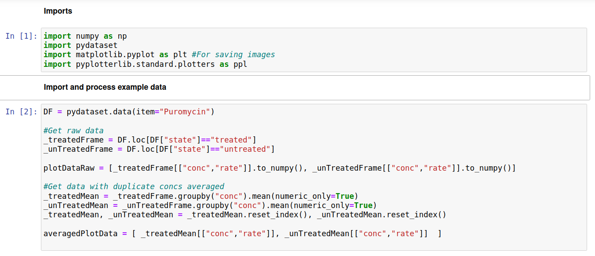
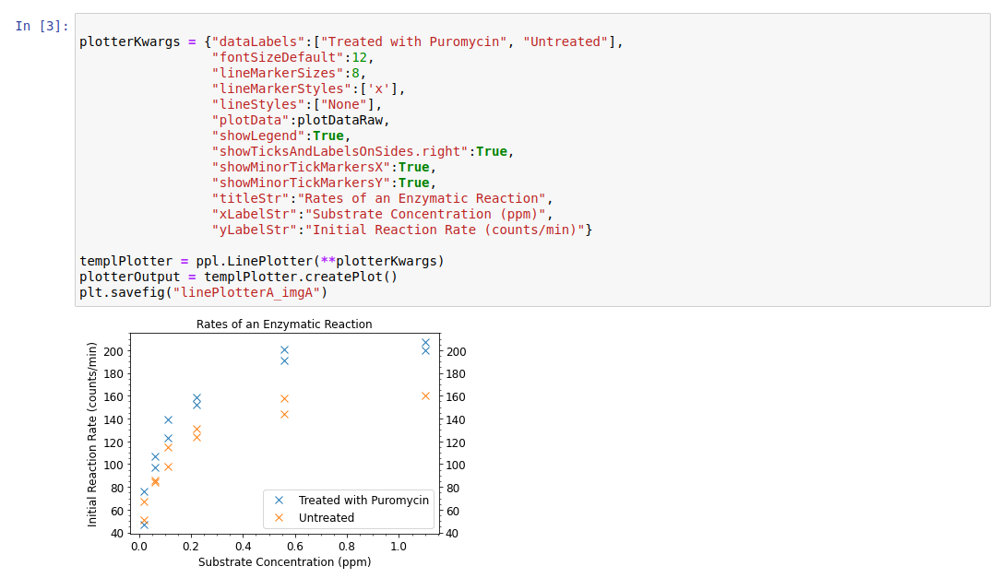
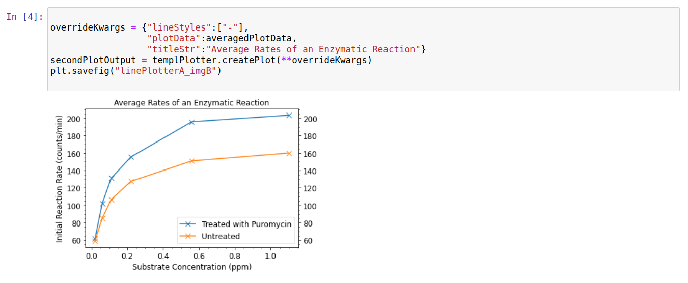
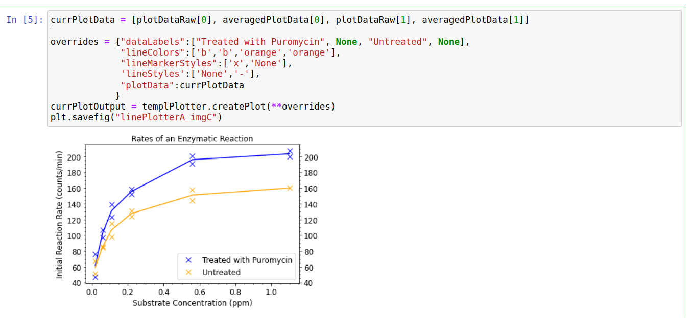

Line Plotter
============

Introduction
------------

In this example we create plots to visualize data in the "Puromycin" dataset found in the pydataset library. While understanding the details of this data set are not essential to following the example, we note that this dataset contains information on rates of an enzymatic reaction, at various substrate concentrations, for both "untreated" (no enzyme) and "treated" (enzyme present) solutions.

Processing Data
---------------

We start by extracting the raw data from a pandas dataframe (plotDataRaw). This dataset contains (in most cases) 2 measurements for each substrate concentration. Therefore we also generate plot data which uses the mean value for duplicate measurements - this will likely be clearer once the plots are shown.

Plotting Data
-------------

We first create a plot and plotter using the raw data; we will reuse this plotter as a template for later. 

The plot allows us to see every data point, and gives us some confidence there are no large outliers. This is also sufficient to see the overall trends in the data, though it would be clearer by plotting the average for each duplicate data point. For this we only need to i) change the plot data, ii) change the plot title, and iii) add lines connecting adjacent datapoints. Thus, it makes good sense to reuse our original plotter as a template:

This plot makes the trends clearer, but hides our uncertainty regarding any specific rate. It is common to use error bars (not implemented in pyplotterlib at time of writing) for this purpose, but since we only have two duplicate measurements per concentration it makes more sense to simply plot these directly. This is accomplished as follows:

This graph does a reasonable job of showing both the overall trend and measurement uncertainties in a single plot.

Raw Code
--------

The code below can be run directly, assuming dependencies are properly installed, to save images of the three plots in the working directory.::

	import numpy as np
	import pydataset
	import matplotlib.pyplot as plt #For saving images
	import pyplotterlib.standard.plotters as ppl
	
	DF = pydataset.data(item="Puromycin")
	
	_treatedFrame = DF.loc[DF["state"]=="treated"]
	_unTreatedFrame = DF.loc[DF["state"]=="untreated"]
	plotDataRaw = [_treatedFrame[["conc","rate"]].to_numpy(), _unTreatedFrame[["conc","rate"]].to_numpy()]
	
	_treatedMean = _treatedFrame.groupby("conc").mean(numeric_only=True)
	_unTreatedMean = _unTreatedFrame.groupby("conc").mean(numeric_only=True)
	_treatedMean, _unTreatedMean = _treatedMean.reset_index(), _unTreatedMean.reset_index()
	averagedPlotData = [ _treatedMean[["conc","rate"]], _unTreatedMean[["conc","rate"]]  ]
	
	plotterKwargs = {"dataLabels":["Treated with Puromycin", "Untreated"],
	                 "fontSizeDefault":12,
	                 "lineMarkerSizes":8,
	                 "lineMarkerStyles":['x'],
	                 "lineStyles":["None"],
	                 "plotData":plotDataRaw,
	                 "showLegend":True,
	                 "showTicksAndLabelsOnSides.right":True,
	                 "showMinorTickMarkersX":True,
	                 "showMinorTickMarkersY":True,
	                 "titleStr":"Rates of an Enzymatic Reaction",
	                 "xLabelStr":"Substrate Concentration (ppm)",
	                 "yLabelStr":"Initial Reaction Rate (counts/min)"}
	templPlotter = ppl.LinePlotter(**plotterKwargs)
	plotterOutput = templPlotter.createPlot()
	plt.savefig("linePlotterA_imgA")
	
	overrideKwargs = {"lineStyles":["-"],
	                  "plotData":averagedPlotData,
	                  "titleStr":"Average Rates of an Enzymatic Reaction"}
	secondPlotOutput = templPlotter.createPlot(**overrideKwargs)
	plt.savefig("linePlotterA_imgB")
	
	currPlotData = [plotDataRaw[0], averagedPlotData[0], plotDataRaw[1], averagedPlotData[1]]
	
	overrides = {"dataLabels":["Treated with Puromycin", None, "Untreated", None],
	             "lineColors":['b','b','orange','orange'],
	             "lineMarkerStyles":['x','None'],
	             'lineStyles':['None','-'],
	             "plotData":currPlotData
	            }
	currPlotOutput = templPlotter.createPlot(**overrides)
	plt.savefig("linePlotterA_imgC")
	
 
