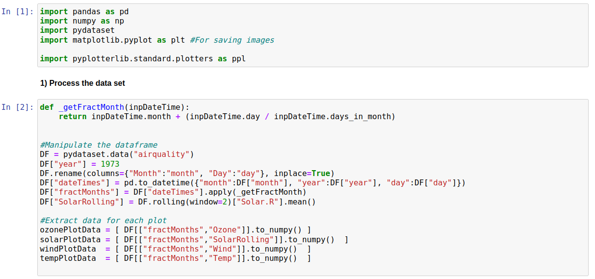
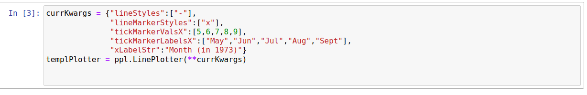
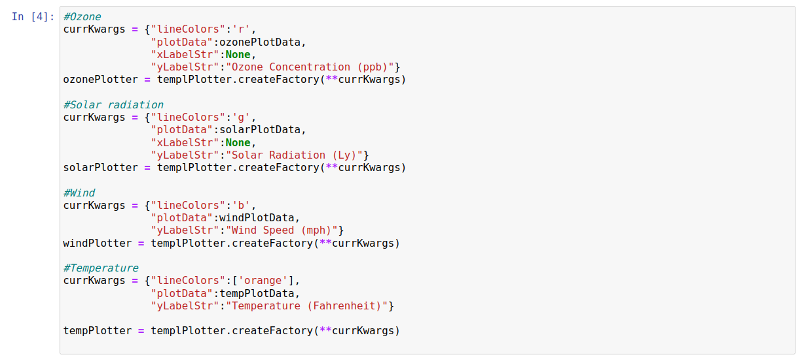
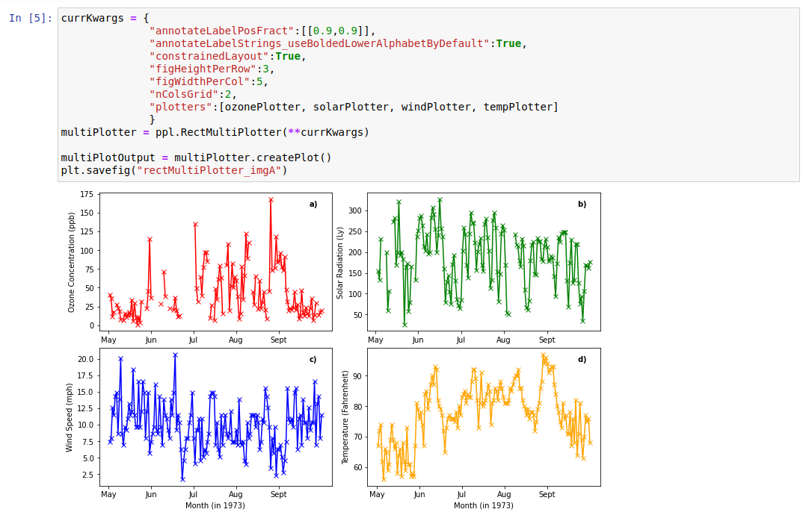

Multi-Plotter
=============

Introduction
------------

In this example we create plots using the "airquality" dataset from the pydataset library. This contains meterological measurements taken at various points for a 6 month period in New York in 1973. It includes measurements of ozone concentration, solar radiation, wind speed, and temperature. Whilst these are all related quantities which we may wish to see simulatneously, it would be impractical to try to display them on a single graph. Thus, this serves as an example of where a grid of plots may be required.

Processing Data
---------------

The data given includes a month number and a "day of month" number. This form is awkward to plot, so the main data processing involves turning these values into fractional months. We also use the 2-day rolling average for solar radiation, to reduce oscillations. We extract the various plot data as shown below:

Plotting Data
-------------

We next want to create a plotter for each data series. We want multiple options to be shared between all (*e.g* the x-axis markers) so we start by creating a template plotter:

The next step is to create an individual plotter for each data series we want to plot, generally overiding at minimum the templates plotData and y-axis label (which we left empty).

We could now separately create four plots. But its more convenient to place them in a grid. We use RectMultiPlotter for this, passing the individual plotters and details on how we want our grid configured (*e.g* how many columns to use and how much space per column/row). Its also often useful to label each graph, RectMultiPlotter has an option "annotateLabelStrings_useBoldedLowerAlphabetByDefault" which (as the name suggests) annotates each plot, in order, with a lower case bolded letter as is common practise for many journal articles. The position of each is set with the "annotateLabelPosFract" option; we put them all in the same relative position here but it is also possible to put set the position for each plot separately. The code to create the grid of plots is shown below:

Raw Code
--------

The raw code to generate this plot is shown below::

	import pandas as pd
	import numpy as np
	import pydataset
	import matplotlib.pyplot as plt #For saving images
	
	import pyplotterlib.standard.plotters as ppl
	
	def _getFractMonth(inpDateTime):
	    return inpDateTime.month + (inpDateTime.day / inpDateTime.days_in_month)
	
	DF = pydataset.data("airquality")
	DF["year"] = 1973
	DF.rename(columns={"Month":"month", "Day":"day"}, inplace=True)
	DF["dateTimes"] = pd.to_datetime({"month":DF["month"], "year":DF["year"], "day":DF["day"]})
	DF["fractMonths"] = DF["dateTimes"].apply(_getFractMonth)
	DF["SolarRolling"] = DF.rolling(window=2)["Solar.R"].mean()
	
	ozonePlotData = [ DF[["fractMonths","Ozone"]].to_numpy() ]
	solarPlotData = [ DF[["fractMonths","SolarRolling"]].to_numpy()  ]
	windPlotData  = [ DF[["fractMonths","Wind"]].to_numpy()  ]
	tempPlotData  = [ DF[["fractMonths","Temp"]].to_numpy()  ]
	
	currKwargs = {"lineStyles":["-"],
	              "lineMarkerStyles":["x"],
	              "tickMarkerValsX":[5,6,7,8,9],
	              "tickMarkerLabelsX":["May","Jun","Jul","Aug","Sept"],
	              "xLabelStr":"Month (in 1973)"}
	templPlotter = ppl.LinePlotter(**currKwargs)
	
	currKwargs = {"lineColors":'r',
	              "plotData":ozonePlotData,
	              "xLabelStr":None,
	              "yLabelStr":"Ozone Concentration (ppb)"}
	ozonePlotter = templPlotter.createFactory(**currKwargs)
	
	currKwargs = {"lineColors":'g',
	              "plotData":solarPlotData,
	              "xLabelStr":None,
	              "yLabelStr":"Solar Radiation (Ly)"}
	solarPlotter = templPlotter.createFactory(**currKwargs)
	
	currKwargs = {"lineColors":'b',
	              "plotData":windPlotData,
	              "yLabelStr":"Wind Speed (mph)"}
	windPlotter = templPlotter.createFactory(**currKwargs)
	
	currKwargs = {"lineColors":['orange'],
	              "plotData":tempPlotData,
	              "yLabelStr":"Temperature (Fahrenheit)"}
	
	tempPlotter = templPlotter.createFactory(**currKwargs)
	
	currKwargs = {
	              "annotateLabelPosFract":[[0.9,0.9]],
	              "annotateLabelStrings_useBoldedLowerAlphabetByDefault":True,
	              "constrainedLayout":True,
	              "figHeightPerRow":3,
	              "figWidthPerCol":5,
	              "nColsGrid":2,
	              "plotters":[ozonePlotter, solarPlotter, windPlotter, tempPlotter]
	              }
	multiPlotter = ppl.RectMultiPlotter(**currKwargs)
	multiPlotOutput = multiPlotter.createPlot()
	plt.savefig("rectMultiPlotter_imgA")
	

