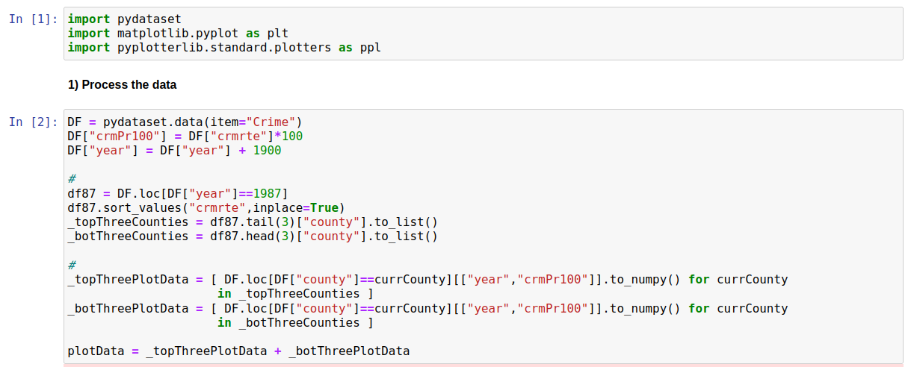
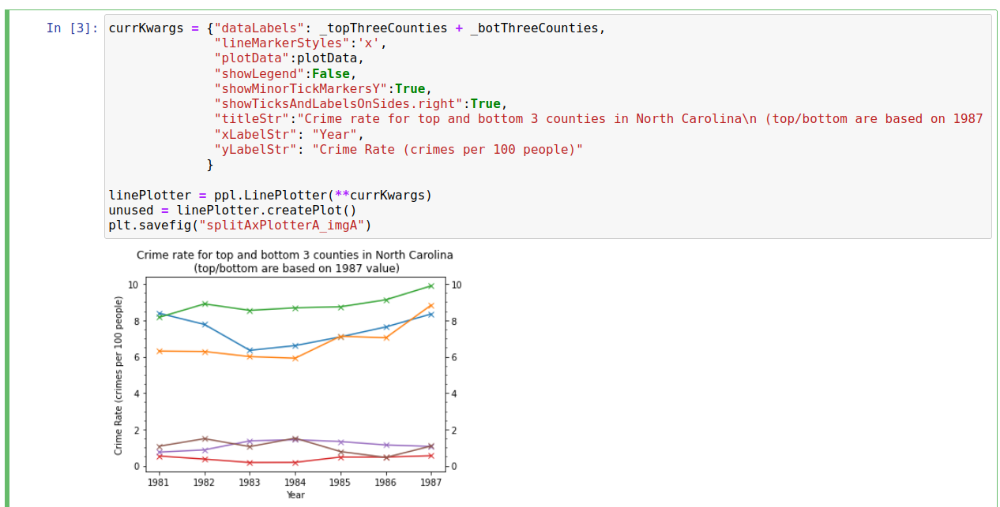
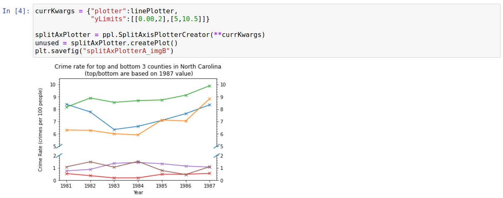
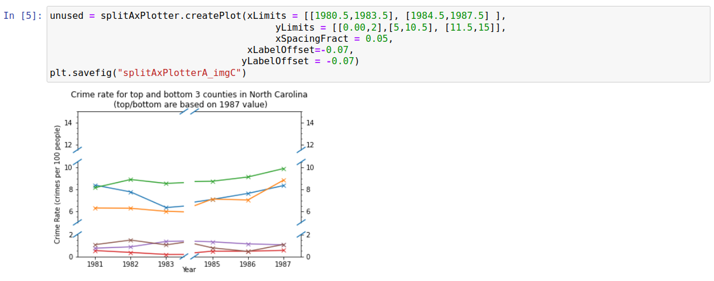
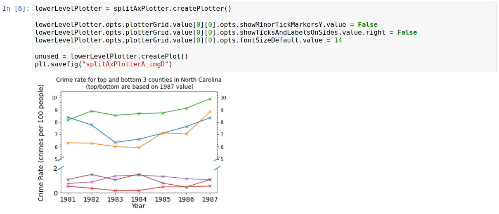

Split Axis Plotter
==================

Introduction
------------
We use the "Crime" dataset from pydataset to demonstrate the use of a split axis plotter (which allows breaks in the axes). This dataset contains information on crime rates for various counties in North Carolina over the 1981 to 1987 period. We will plot how the rates change with time for i) the three counties with the highest crime rate in 1987, and ii) the three counties with the lowest crime rate in 1987. This will lead to a plot with significant whitespace along the y-axis, making it a reasonable candidate for using an axis-break for. 

Processing Data
---------------

We want to i) find which counties have the top/bottom crime rates in 1987, and ii) extract year vs crime rate for the top/bottom three. We also want to convert crime rate from *per person* to *per 100 people*, since this leads to rounder numbers. The code to carry out these transformations is shown below

Plotting Data
-------------

We start by creating a simple line plot for our data

While this does a reasonable job of showing the trends, there is a lot of blank white-space along the y-axis and, as a result, it is difficult to read-off crime rates with any degree of precision (minor y-tick markers are every 0.5). We can solve this relatively easily using the "SplitAxisPlotterCreator"; in this case we simply need to pass in the plotter and the y-limits we want for each section, as shown below

It is now easier to see the value of each data point with greater precision (minor y-tick markers are now every 0.25) without using any more space or losing any information.

While this plot looks fine as it is, it is worth looking at some other settings for split/broken axes. Firstly, we demonstrate below that multiple axis splits can be carried out easily. We also move the x/y labels closer to the axes; this may need doing fairly commonly when using the SplitAxisPlotterCreator (though it wasn't *really* neccesary in this case, and was done more for demonstration reasons).

The "SplitAxisPlotterCreator" class used above actually creates a lower level plotter ("SplitAxisPlotter") as an intermediate when creating plots. This lower level plotter holds a grid of plotters with dimensions (xSplits+1)*(ySplits+1), where xSplits and ySplits are the number of times the x/y axis have been split/broken respectively. There **should be no need** to ever interact with this lower-level, more unwieldly, plotter but it provides greater control over the plot than "SplitAxisPlotterCreator"; the most likely use case is probably to circumvent any bugs which may pop up in "SplitAxisPlotterCreator". Purely for demonstration reasons, the below shows a case where we have specifically overwritten options for the bottom half of the axis.

Raw Code
--------

The code to generate these above images is shown below::

	import pydataset
	import matplotlib.pyplot as plt
	import pyplotterlib.standard.plotters as ppl
	
	DF = pydataset.data(item="Crime")
	DF["crmPr100"] = DF["crmrte"]*100
	DF["year"] = DF["year"] + 1900
	
	df87 = DF.loc[DF["year"]==1987]
	df87.sort_values("crmrte",inplace=True)
	_topThreeCounties = df87.tail(3)["county"].to_list()
	_botThreeCounties = df87.head(3)["county"].to_list()
	
	_topThreePlotData = [ DF.loc[DF["county"]==currCounty][["year","crmPr100"]].to_numpy() for currCounty
	                     in _topThreeCounties ]
	_botThreePlotData = [ DF.loc[DF["county"]==currCounty][["year","crmPr100"]].to_numpy() for currCounty
	                     in _botThreeCounties ]
	
	plotData = _topThreePlotData + _botThreePlotData
	
	
	currKwargs = {"dataLabels": _topThreeCounties + _botThreeCounties,
	              "lineMarkerStyles":'x',
	              "plotData":plotData,
	              "showLegend":False,
	              "showMinorTickMarkersY":True,
	              "showTicksAndLabelsOnSides.right":True,
	              "titleStr":"Crime rate for top and bottom 3 counties in North Carolina\n (top/bottom are based on 1987 value)",
	              "xLabelStr": "Year",
	              "yLabelStr": "Crime Rate (crimes per 100 people)"
	             }
	
	linePlotter = ppl.LinePlotter(**currKwargs)
	unused = linePlotter.createPlot()
	plt.savefig("splitAxPlotterA_imgA")
	
	currKwargs = {"plotter":linePlotter,
	              "yLimits":[[0.00,2],[5,10.5]]}
	
	splitAxPlotter = ppl.SplitAxisPlotterCreator(**currKwargs)
	unused = splitAxPlotter.createPlot()
	plt.savefig("splitAxPlotterA_imgB")
	
	unused = splitAxPlotter.createPlot(xLimits = [[1980.5,1983.5], [1984.5,1987.5] ],
	                                        yLimits = [[0.00,2],[5,10.5], [11.5,15]],
	                                        xSpacingFract = 0.05,
	                                   xLabelOffset=-0.07,
	                                  yLabelOffset = -0.07)
	plt.savefig("splitAxPlotterA_imgC")
	
	lowerLevelPlotter = splitAxPlotter.createPlotter()
	
	lowerLevelPlotter.opts.plotterGrid.value[0][0].opts.showMinorTickMarkersY.value = False
	lowerLevelPlotter.opts.plotterGrid.value[0][0].opts.showTicksAndLabelsOnSides.value.right = False
	lowerLevelPlotter.opts.plotterGrid.value[0][0].opts.fontSizeDefault.value = 14
	
	unused = lowerLevelPlotter.createPlot()
	plt.savefig("splitAxPlotterA_imgD")
	

