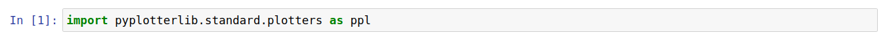
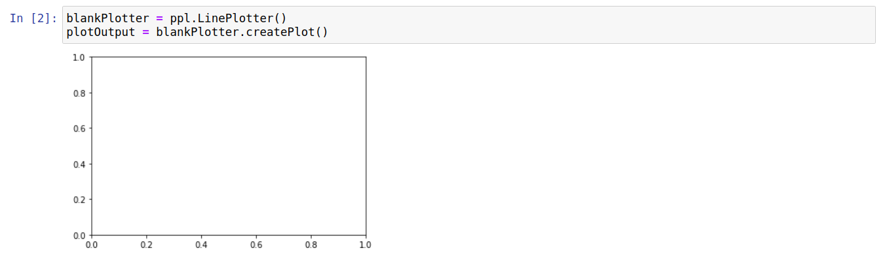
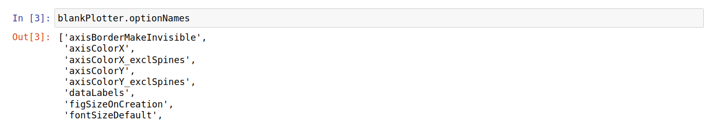
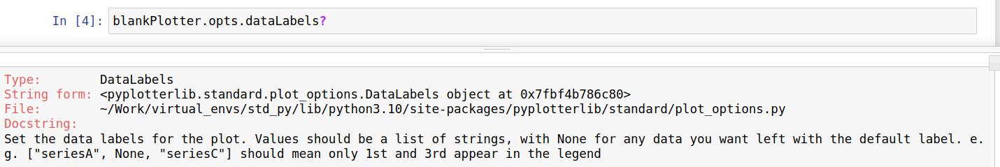
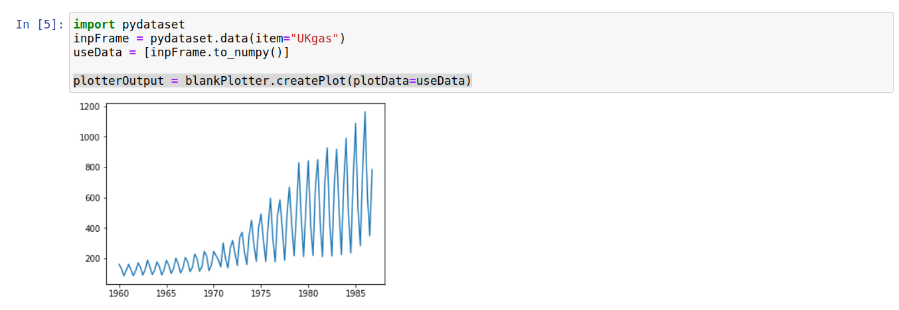
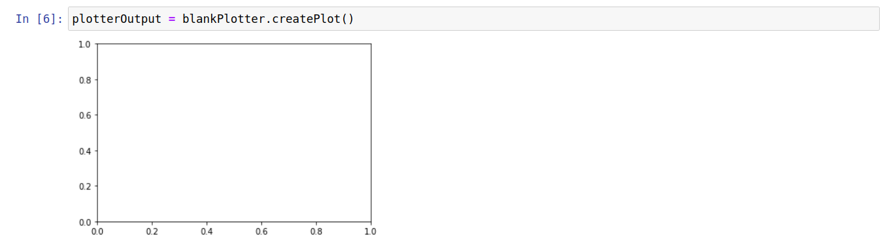
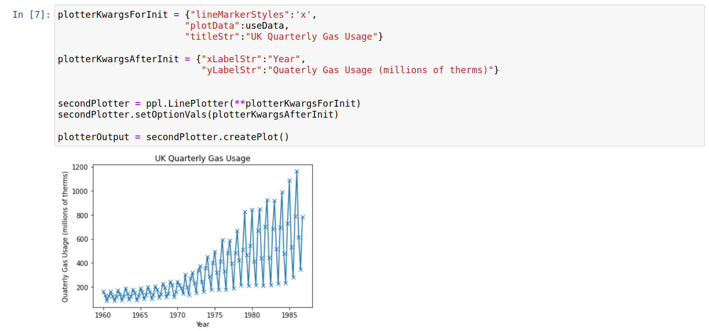
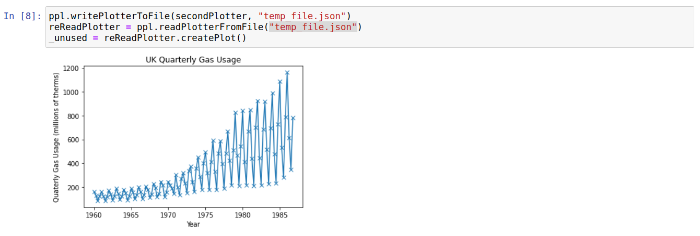
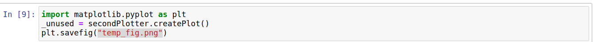

Quick Start
===========

The main interface can be imported as follows:

Creating Simple Plots
---------------------

The simplest thing that can be done is to create a blank plotter and, subsequently, a blank plot. This can be accomplished as follows:

The plotter object essentially encapsulates all the options and commands needed to make a plot. We can set various options to create more complicated plots. A list of all option names can be accessed via the "optionNames" property as follows:

We can see what each of these corresponds to in a jupyter notebook as follows, using dataLabels as an example:

We can modify the options **for a single plot** by passing optionName=optionValue at plot-creation time. This can be seen best using an example, where we add some data to our plot:

We can verify that this was only changed for a single plot by trying to create another plot without passing the plotData argument:

This behavior allows a plotter to be used as a rough template for when you want to create multiple similar plots (*e.g.* multiple line plots with the same axis labels but different data).

Options can also be set on the plotter-level; in this case these are the defaults for the objects createPlot function. These values are generally set upon initialization by passing optionName=optionValue pairs or post-initiation using an {optionName:optionVal} dictionary. The code sample below shows both methods being used:

Saving Plotters/Plots
---------------------

Currently, there is an in-built method for reading/writing any in-built plotter to a file. This provides a simple way to transfer plotting templates (for example) between notebooks/computers/people. The small code segment below demonstrates how to write/read plotters to a file:

For now, there isnt a built in way to save image files (*e.g.* .png or .eps) corresponding to the created plots. However, the plots are created by matplotlib; therefore you can use their method for saving a plot-image to file:

