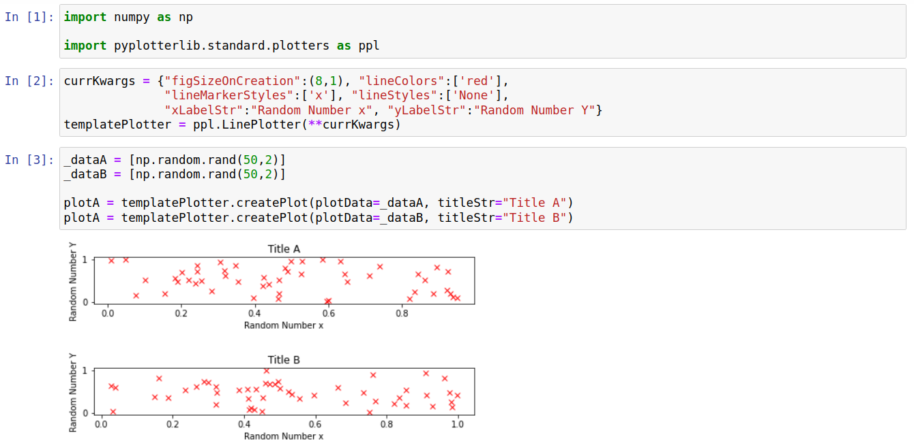
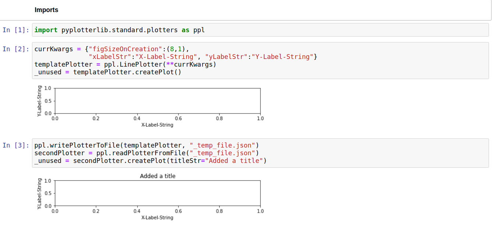
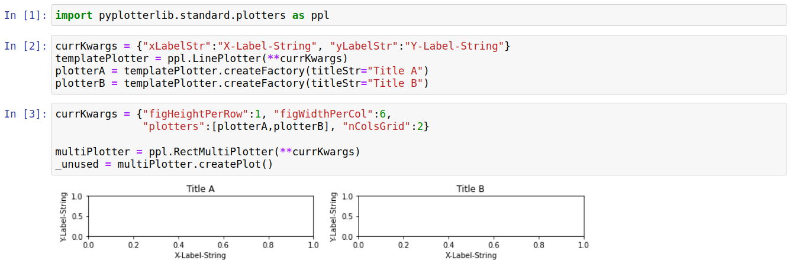
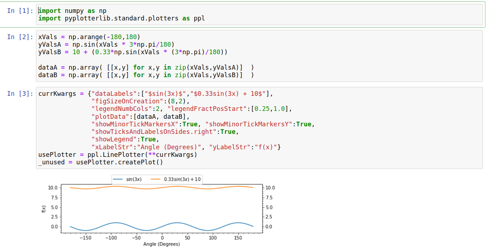
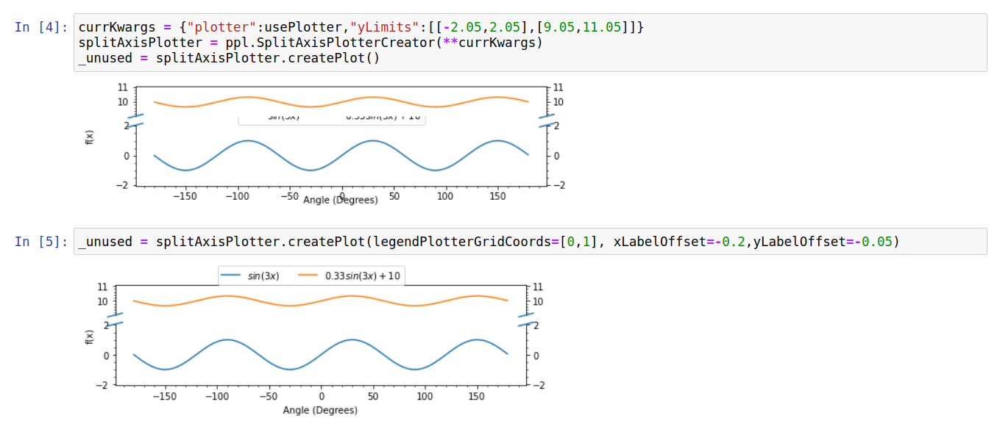

Why Pyplotterlib?
=================

Pyplotterlib, in my opinion, makes certain tasks easier than other plotting libraries (most notably matplotlib, which is used as the backend). I attempt to show this with some examples of its functionality below:

Template Plotters/Plots
-----------------------

When creating multiple plots, certain features are often shared between them (*e.g.* font sizes, figure sizes, axis-labels). Encapsulating these features in a plotter object makes it simple to factor them into a template plotter, which saves setting the same options for multiple plots. Note that it is relatively easy to share these template plotters between notebooks/computers/people since they can be written to/read from files (discussed more below). The toy example below shows the use of a template plotter in order to create two plots that differ only by the plot title and the data used; note how constant properties such as the axis labels are only set once.

Serialization
-------------

All built-in plotters have functions to convert them to and from a JSON representation. This allows them to be in stored in files, providing a simple way to transfer them between notebooks/computers/people. There are various situations where this is preferable to either sending images of a plot, or the code to create a plot. Examples are:

* To allow a plotter template to be shared between people; this can be used to standardise options for a certain type of plot. The most obvious alternative to this would be to send python code files which (at least in my opinion) would be less safe and more awkward.
* When sending someone a plot/figure to be included in a larger piece of work. For example, if you are not the primary author of a paper you may need to send plots/figures to the main author. Sending a plotter (instead of, or aswell as, a static image) provides an easy way for the main author to change small details such as font sizes or figure dimensions if required.
* Its common (at least for me) to combine multiple individual plots into a grid. This can be difficult with other libraries if the individual plots were created in different notebooks. However, this is reasonably simple with pyplotterlib as you can just dump the plotters into individual files, load them (from files) into another notebook, and combine them into a grid of plots.

The ease with which plotters can be written/read/modified is shown with the toy example below.

 
Combining Independent Plots
---------------------------

Its common (at least for me) to make multiple plots independently and **later decide** to combine them into a grid of plots. Plotters can be grouped together using the "RectMultiPlotter" class in pyplotterlib. RectMultiPlotter takes a group of plotters and, when createPlot is called, combines them into a grid. This is best seen with an example; a simple, toy example is given below.

Axis Breaks
-----------

Sometimes you want to plot data that is discontinous, with large gaps in either the x-direction or y-direction (or both). In these cases using continous axes may lead to a graph which has a large amount of empty space, making it difficult to see variations within the data. One solution to this is to put breaks in one (or sometimes both) of the axes. Ideally, this should be as simple as setting the limits for the continous parts of the axes; in practice it is often significantly more difficult. One goal of pyplotterlib is to make axis-breaks simpler to implement compared to the matplotlib backend. Currently this is can be *slightly* more fiddly than setting the axis-limits; an example is shown below where a couple of other options also need changing to get a reasonable looking plot with an axis break:

This initial plot has a large amount of whitespace along the y-direction. This makes clear the large separation in y-values for each data set, but makes it difficult to determine the amplitude of the waves (*i.e.* the gap between the max(y) and min(y) values). 

The initial attempt to add an axis break with default options led to a few issues: i) the legend is in an awkward place, ii) the y-label is too far from the axis, and iii) the x-label is too close to the axis. Upon splitting, we have essentially created two separate axes with the legend placed in the bottom one by default; setting the "legendPlotterGridCoords" option allows us to position it in the top-axis instead. The gap between x/y labels and the axis is controlled by the xLabelOffset and yLabelOffset options; these offsets are in units of fractional height/width. The default values (-0.1) tend to work reasonably for plots with default dimensions but fail for this plot which is unusually wide and short, hence these values need to be altered slightly.

The final plot does a reasonable job of showing both the large gap in y-values between the data series, and the difference in the wave amplitudes between them.

